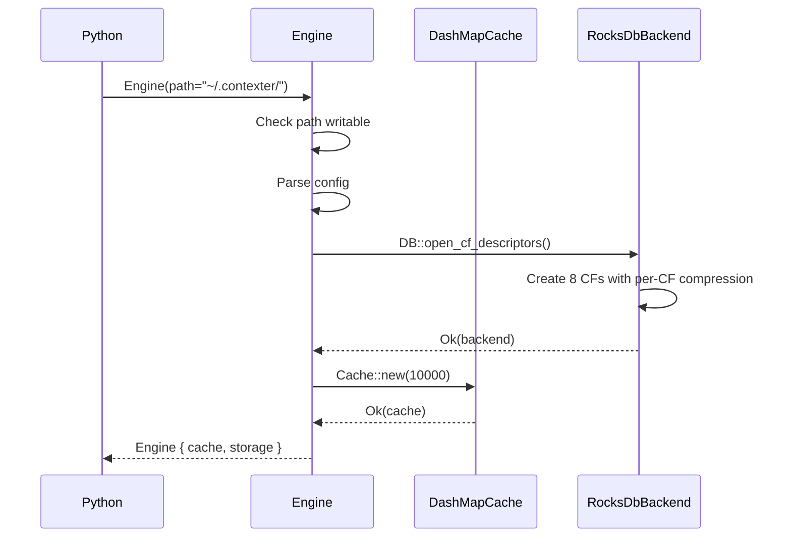
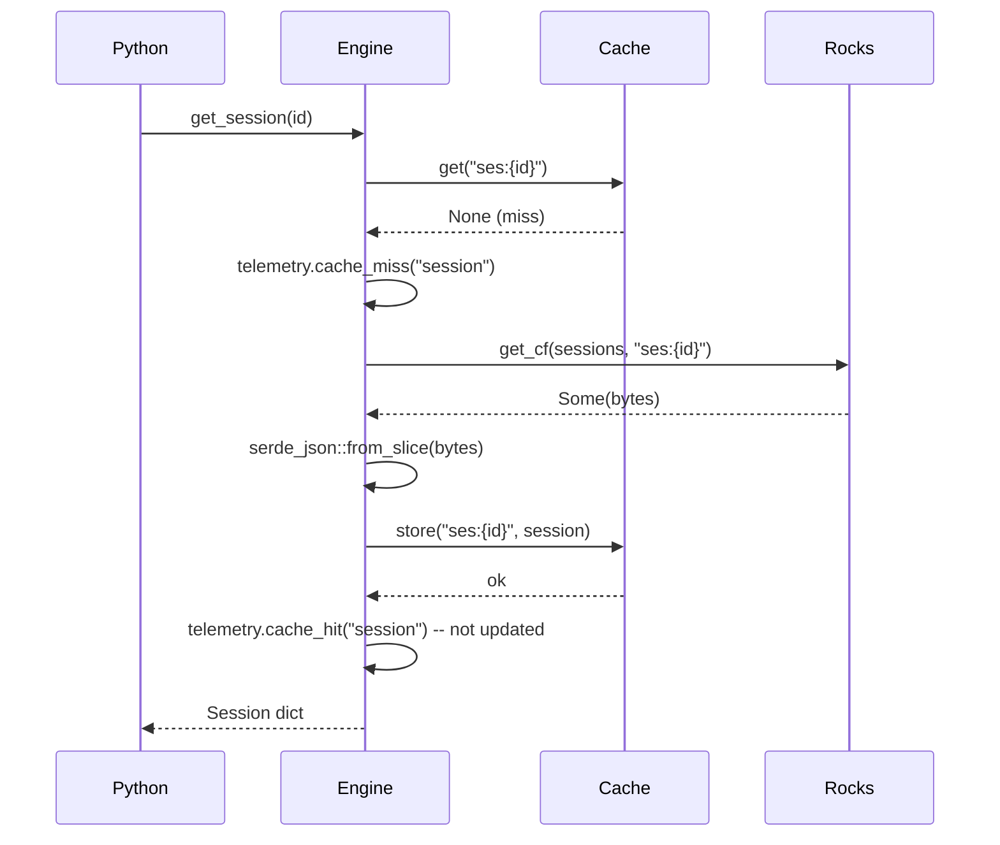
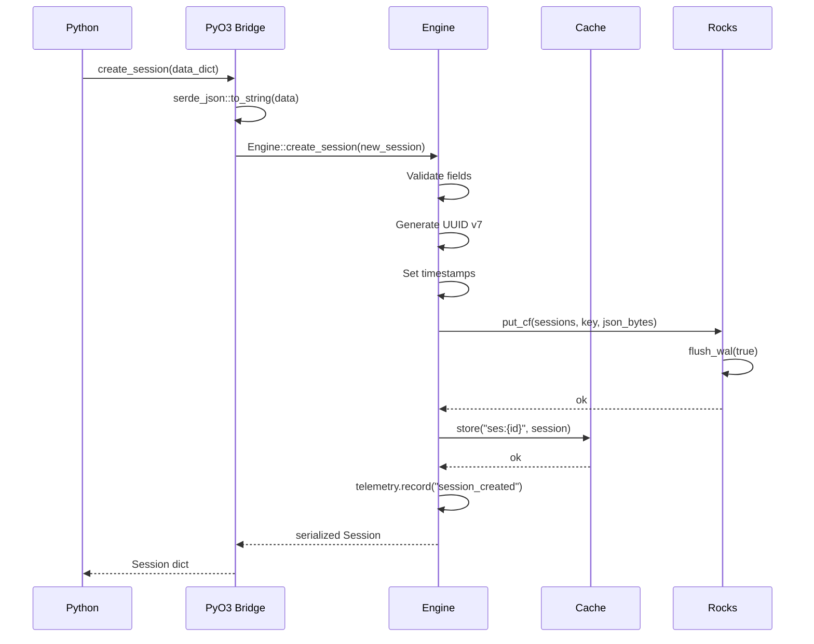

# Contexter Phase 1 — Rust Core Foundation: Design Preview (APPROVED)

> **Status:** `✅ APPROVED` · **Version:** `v0.1.0`
> **Unanimous Approval:** 0 Open Questions

---

## System Architecture (APPROVED)

### Module Hierarchy

```
┌──────────────────────────────────────────────────────────────┐
│ Python CLI / Wrapper (asyncio.to_thread + ThreadPoolExecutor)│
└───────────────────────┬──────────────────────────────────────┘
                        │ PyO3 JSON boundary
┌───────────────────────▼──────────────────────────────────────┐
│  Engine (#[pyclass])                                         │
│  ┌──────────────────────────┐  ┌──────────────────────────┐  │
│  │ DashMapCache (L1)        │  │ Box<dyn StorageBackend>   │  │
│  │ Per-type LRU · 10K cap   │  │ ┌────────────────────┐   │  │
│  │ write-through on create   │  │ │ RocksDbBackend (L2)│   │  │
│  │ write-around on update   │  │ │ 8 CFs w/ per-CF    │   │  │
│  │ invalidate on delete     │  │ │ compression         │   │  │
│  └──────────────────────────┘  │ └────────────────────┘   │  │
│  + stubs: VectorTier (L3),     └──────────────────────────┘  │
│    FullTextTier (L4),                                         │
│    AnalyticsTier (L5)                                          │
└──────────────────────────────────────────────────────────────┘
```

### Column Family Map (APPROVED)

| CF Name | Entity | Compression | Target Block Size | Use Case |
|---|---|---|---|---|
| `memory_items` | Memory records | `Zstd` | 64KB | Primary memory storage |
| `sessions` | Session records | `Zstd` | 32KB | Session CRUD |
| `agents` | Agent definitions | `LZ4` | 16KB | Agent CRUD (speed > density) |
| `skills` | Skill definitions | `LZ4` | 16KB | Skill CRUD (speed > density) |
| `efficiency_map` | Efficiency data | `LZ4` | 8KB | Map agent→skill pairs |
| `telemetry` | Usage telemetry | `LZ4` | 4KB | High-write, low-read |
| `conflicts` | CRDT conflict records | `Zstd` | 8KB | Conflict resolution |
| `index_state` | Index metadata | `LZ4` | 4KB | Cross-index state |

### Key Structure (APPROVED)

All keys are byte-prefixed for prefix scanning:

| Entity | Key Pattern | Example |
|---|---|---|
| Session | `ses:{uuid_v7}` | `ses:0194c4e0-...` |
| Memory | `mem:{uuid_v7}` | `mem:0194c4e1-...` |
| Agent | `agt:{uuid_v7}` | `agt:0194c4e2-...` |
| Skill | `skl:{uuid_v7}` | `skl:0194c4e3-...` |

---

## Data Flow (APPROVED)

### Engine Initialization (APPROVED)

```
Engine::new(config)
  1. Determine data path from config (default: ~/.contexter/)
  2. Check path is writable
  3. Open RocksDB: DB::open_cf_descriptors() with 8 CF descriptors
       - Each CF: CompressionType(Zstd/LZ4), target_file_size_base
       - create_if_missing: true
  4. Initialize DashMapCache with per-type capacity (default: 10,000)
  5. Return Engine { cache, storage, config, telemetry }
```

### Write Path: create_session (APPROVED)

```
create_session(data)
  ✓ Validate all required fields present
  ✓ Generate UUID v7
  ✓ Set created_at = last_active = Utc::now()
  ✓ Set turn_count = 0, duration_ms = 0
  ✓ Serialize to JSON bytes
  ✓ Write to RocksDB sessions CF + WAL flush
  ✓ Populate cache (write-through)
  ✓ Record telemetry (session_created, latency)
  ✓ Return serialized Session
```

### Read Path: get_session (APPROVED)

```
get_session(id)
  ✓ Cache lookup by "ses:{id}"
  → HIT: return cached, record cache_hit telemetry
  → MISS: RocksDB get_cf(sessions_cf, "ses:{id}")
    → Found: populate cache, return deserialized
    → Not found: return None, record cache_miss telemetry
```

### Delete Path: delete_session (APPROVED)

```
delete_session(id)
  ✓ Validate UUID format
  ✓ Load existing session (fail if not found? No — idempotent: Ok if gone)
  ✓ Delete from RocksDB sessions CF
  ✓ Invalidate cache entry
  ✓ Record telemetry (session_deleted)
  ✓ Return Ok
```

---

## API Contract (APPROVED)

### Rust `StorageBackend` Trait

```rust
#[async_trait]  // Note: sync in Phase 1, async bound for future remote backends
pub trait StorageBackend: Send + Sync {
    fn create_session(&self, session: NewSession) -> Result<Session, EngineError>;
    fn get_session(&self, id: Uuid) -> Result<Option<Session>, EngineError>;
    fn list_sessions(&self, filter: &SessionFilter) -> Result<Vec<Session>, EngineError>;
    fn update_session(&self, id: Uuid, patch: &SessionPatch) -> Result<Session, EngineError>;
    fn delete_session(&self, id: Uuid) -> Result<(), EngineError>;

    fn create_memory(&self, memory: NewMemory) -> Result<Memory, EngineError>;
    fn get_memory(&self, id: Uuid) -> Result<Option<Memory>, EngineError>;
    fn search_memories(&self, query: &MemorySearchQuery) -> Result<Vec<Memory>, EngineError>;
    fn update_memory(&self, id: Uuid, patch: &MemoryPatch) -> Result<Memory, EngineError>;
    fn delete_memory(&self, id: Uuid) -> Result<(), EngineError>;

    fn create_agent(&self, agent: NewAgent) -> Result<Agent, EngineError>;
    fn get_agent(&self, id: Uuid) -> Result<Option<Agent>, EngineError>;
    fn list_agents(&self, filter: &AgentFilter) -> Result<Vec<Agent>, EngineError>;

    fn create_skill(&self, skill: NewSkill) -> Result<Skill, EngineError>;
    fn get_skill(&self, id: Uuid) -> Result<Option<Skill>, EngineError>;
    fn list_skills(&self, filter: &SkillFilter) -> Result<Vec<Skill>, EngineError>;

    // Generic KV
    fn store(&self, cf: &str, key: &[u8], value: &[u8]) -> Result<(), EngineError>;
    fn get(&self, cf: &str, key: &[u8]) -> Result<Option<Vec<u8>>, EngineError>;

    // Maintenance
    fn checkpoint(&self) -> Result<u64, EngineError>;
    fn storage_size(&self) -> Result<HashMap<String, u64>, EngineError>;
}

pub struct RocksDbBackend {
    db: DB,
    cfs: ColumnFamilyMap,
    config: RocksDbConfig,
}
```

### Python `Engine` API

```python
class Engine:
    """Async wrapper around the Rust PyO3 bridge."""

    def __init__(self, path: str = "~/.contexter/"):
        ...

    async def create_session(self, data: dict) -> dict
    async def get_session(self, id: str) -> dict | None
    async def list_sessions(self, filter: dict | None = None) -> list[dict]
    async def update_session(self, id: str, patch: dict) -> dict
    async def delete_session(self, id: str) -> None

    async def create_memory(self, data: dict) -> dict
    async def get_memory(self, id: str) -> dict | None
    async def search_memories(self, query: dict) -> SearchResults
    async def update_memory(self, id: str, patch: dict) -> dict
    async def delete_memory(self, id: str) -> None

    async def create_agent(self, data: dict) -> dict
    async def get_agent(self, id: str) -> dict | None
    async def list_agents(self, filter: dict | None = None) -> list[dict]

    async def create_skill(self, data: dict) -> dict
    async def get_skill(self, id: str) -> dict | None
    async def list_skills(self, filter: dict | None = None) -> list[dict]

    async def store(self, cf: str, key: str, value: str) -> None
    async def get(self, cf: str, key: str) -> str | None

    async def checkpoint(self) -> int
    async def storage_size(self) -> dict
    async def status(self) -> dict

    def _run_sync(self, fn: Callable, *args) -> Any:
        """Run sync Rust call on thread pool."""
        ...
```

### CLI Interface

```
contexter status
contexter session create --project <p> --agent-id <id> [--status <s>] [--metadata <json>]
contexter session list [--project <p>] [--limit <n>] [--offset <n>]
contexter session get <id>
contexter session update <id> [--field <value>...]
contexter session delete <id>
contexter memory create --session-id <sid> --agent-id <aid> --type <t> --content <c> [--tags <t1,t2>]
contexter memory search --keywords <k> [--type <t>] [--tags <t1,t2>] [--session <sid>] [--limit <n>]
contexter memory get <id>
contexter memory update <id> --content <c>  # tags with --tags
contexter memory delete <id>
contexter checkpoint
```

---

## Out of Scope (CONFIRMED)

| # | Item | Phase |
|---|---|---|
| 01 | Vector embeddings (L3) — HNSW index | Phase 2 |
| 02 | Full-text search with BM25 (L4) — Tantivy | Phase 2 |
| 03 | Analytics engine (L5) — DuckDB | Phase 2 |
| 04 | FastAPI REST server | Phase 3 |
| 05 | FastMCP server | Phase 3 |
| 06 | React UI | Phase 4 |
| 07 | Auto-versioning file watcher | Phase 4 |
| 08 | Multi-user auth | Future |
| 09 | Export / report generation | Phase 4 |
| 10 | Conflict resolution UI | Phase 4 |

---

## Design Decisions (CONFIRMED)

| Decision | Choice | Rationale |
|---|---|---|
| Storage Engine | RocksDB multi-tier | LSM tree, per-CF compression, no external process |
| Hot Cache | DashMap + per-type LRU | ~50ns reads, concurrent, isolated eviction |
| Primary Key | UUID v7 | Time-ordered, sortable, range-scannable |
| PyO3 Boundary | JSON serialization | Simple, debuggable, clear contract |
| Bridge Sync Model | Sync Rust → async Python | RocksDB ops are native sync; asyncio.to_thread wraps correctly |
| Keyword Search (P1) | Substring scan with scoring | Workable for Phase 1; Tantivy in Phase 2 |
| Cascade Delete | No cascade | Memories are durable, survive session deletion |
| CF Validation | Allow-list of 8 CFs | Prevents silent typos creating unexpected CFs |
| Error Type | `EngineError` enum | Structured errors with context, convertible to PyErr |
| Compression Utils | Optional `compression` feature | Not all backends need compression; feature-gated |

---

## Architecture Diagrams

### Initialization Sequence



### Session Read Flow (Cache Miss)



### Session Create Flow



---

## Acceptance Criteria (CONFIRMED)

| ID | Description | Verification |
|---|---|---|
| AC-001 | RocksDB engine init with 8 CFs + correct per-CF compression | `cargo test engine_init` |
| AC-002 | Session create + get round-trip | `cargo test session_create_get` |
| AC-003 | Session list with project filter + pagination | `cargo test session_list_filter` |
| AC-004 | Session update persists | `cargo test session_update` |
| AC-005 | Session delete then get returns None | `cargo test session_delete` |
| AC-006 | Memory create with type + tags, version=1 | `cargo test memory_create` |
| AC-007 | Memory search by keyword | `cargo test memory_search_keyword` |
| AC-008 | Memory search with type + tag filters | `cargo test memory_search_filters` |
| AC-009 | Memory version increments on update | `cargo test memory_version_bump` |
| AC-010 | Memory delete then get returns None | `cargo test memory_delete` |
| AC-011 | Agent + skill CRUD round-trips | `cargo test agent_skill_roundtrip` |
| AC-012 | Generic store/get with CF isolation | `cargo test generic_store_isolation` |
| AC-013 | Cache hit returns without RocksDB read | `cargo test cache_hit_no_db` |
| AC-014 | Cache miss populates cache | `cargo test cache_miss_populates` |
| AC-015 | CLI status shows all stats | Manual + `cargo test cli_status` |
| AC-016 | CLI session CRUD end-to-end | Manual + `cargo test cli_session_crud` |
| AC-017 | PyO3 bridge session round-trip | `python -m pytest tests/` |
| AC-018 | Zstd + LZ4 compression round-trips | `cargo test compression_roundtrip` |
| AC-019 | WAL checkpoint reduces WAL size | `cargo test wal_checkpoint` |
| AC-020 | Storage size shows per-CF breakdown | `cargo test storage_size_report` |
| AC-101 | Invalid UUID returns error | `cargo test invalid_uuid_error` |
| AC-102 | Get non-existent returns None | `cargo test get_nonexistent_none` |
| AC-103 | Delete non-existent returns Ok | `cargo test delete_nonexistent_ok` |
| AC-104 | Update non-existent returns error | `cargo test update_nonexistent_error` |
| AC-105 | Read-only path returns init error | `cargo test readonly_path_error` |
| AC-106 | 4 concurrent threads succeed | `cargo test concurrent_reads` |
| AC-107 | 1MB content round-trips | `cargo test large_content_roundtrip` |
| AC-108 | Empty database works | `cargo test empty_db` |
| AC-201 | Cache read latency < 100µs | `cargo bench cache_latency` |
| AC-202 | RocksDB write latency < 5ms | `cargo bench rocksdb_write_latency` |
| AC-203 | All cargo tests pass, clippy clean | `cargo test && cargo clippy` |

---

## Edge Cases (CONFIRMED — Full catalog in EDGE_CASES.md)

| Category | Count | Key Scenarios |
|---|---|---|
| Storage Initialization | 9 | Missing dir, empty db, corrupted MANIFEST, read-only path |
| Session Operations | 11 | Missing fields, pagination bounds, orphaned memories, empty update |
| Memory Operations | 11 | Empty content, massive tags, search with empty query |
| Cache Layer | 7 | Full eviction, write-through races, invalidation on update |
| RocksDB Operations | 4 | Disk full, concurrent CF ops, partial WAL flush |
| PyO3 Bridge | 3 | Invalid Python types, thread pool exhaustion |
| CLI | 2 | Invalid flag values, missing args |
| Compression | 5 | Empty data, corrupted data, unsupported format |

---

**✅ Design Preview Approved** · 2026-07-23 · Contexter Phase 1 — Rust Core Foundation

All 4 open questions resolved. 31 ACs confirmed. 47 edge cases cataloged. 8 CF map final. Architecture, data flow, API contract, and CLI interface approved.
