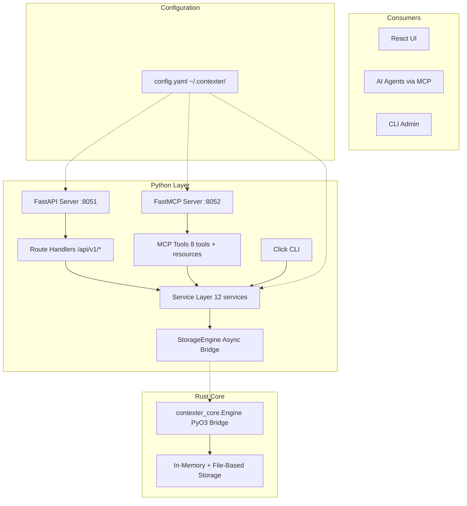
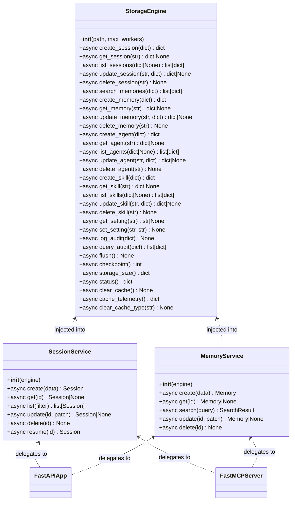

# Contexter — Python API Layer

> **Status:** `APPROVED — Contract Frozen` | **Version:** `v1.0.0`
> **Feature:** 26 Acceptance Criteria · 40 Edge Cases · 9 Tasks

---

## Navigation

- [System Design](#architecture)
- [Data Flow](#dataflow)
- [Context](#context)
- [Decision](#decision)
- [API](#api)
- [AC](#ac)
- [Edge Cases](#edgecases)
- [Tests](#tests)
- [References](#references)
- [Contract](#contract)
- [Summary](#summary)

---

## Quick Stats

| Metric | Value |
|---|---|
| AC Count | 26 |
| Edge Cases | 40 |
| Artifacts | 5 (SPEC, ACCEPTANCE, EDGE_CASES, Draft, Approved) |
| Tasks | 9 (4 Groups) |
| Checkpoints | 4 (A, B, C, D) |
| Ports | 8051 (REST), 8052 (MCP) |

---

## System Design {#architecture}

> **Status:** `FINAL`

### High-Level Architecture



### Component Hierarchy

```
contexter-server/
├── pyproject.toml
├── src/
│   ├── __init__.py
│   ├── main.py
│   ├── mcp_server.py
│   ├── api/           (16 route modules)
│   ├── services/      (12 service modules)
│   ├── models/        (11 model modules)
│   ├── core/bridge.py (StorageEngine)
│   ├── mcp_tools/     (6 tool modules)
│   └── cli/           (4 command modules)
└── tests/
    ├── conftest.py
    ├── models/ / core/ / services/ / api/ / mcp/ / cli/ / integration/
```

### Module Architecture



### Data Models

**Session**
```
id: UUID, agent_id: UUID, project: str, name: str?, status: enum,
started_at: datetime, updated_at: datetime, completed_at: datetime?,
metadata: dict
```

**Memory**
```
id: UUID, session_id: UUID, agent_id: UUID, role: enum,
content: str (PyBytes >100KB), tokens: int?, tokenizer: str?,
model: str?, created_at: datetime, metadata: dict
```

**Agent**
```
id: UUID, name: str, provider: enum, model: str, system_prompt: str?,
temperature: float, max_tokens: int?, tools: list[str]?, metadata: dict,
created_at: datetime, updated_at: datetime
```

**Skill**
```
id: UUID, name: str, description: str?, type: enum, version: str?,
parameters: dict?, enabled: bool, created_at: datetime, updated_at: datetime
```

> ✅ All models are Pydantic v2 BaseModels with type-annotated fields and domain-ubiquitous naming.

---

## Data Flow Sequence {#dataflow}

### Flow 1: API Request → Response

```
1. Client sends HTTP request to FastAPI :8051
2. FastAPI middleware logs: method, path, client_ip
3. Route handler validates via Pydantic model
4. Route handler calls Service method (no business logic in route)
5. Service validates, computes derived fields
6. Service calls StorageEngine bridge method
7. Bridge serializes dict → JSON (or PyBytes if >100KB)
8. asyncio.to_thread() dispatches to ThreadPoolExecutor
9. Rust Engine processes, returns JSON
10. Bridge deserializes JSON → dict
11. Service maps dict → Pydantic model
12. Route returns model → FastAPI serializes to JSON
13. Middleware logs: duration, status_code
14. Response sent (200/201/204/404/422/500)
```

### Flow 2: MCP Tool Call

```
1. AI agent sends tool request to FastMCP :8052 (SSE)
2. MCP router matches tool name
3. Tool handler validates arguments
4. Tool handler calls Service method
5. Same as Flow 1 steps 5-10 (Service → Bridge → Rust)
6. Tool handler formats MCP content response
7. Response sent via SSE
```

### Flow 3: Large Content Path

```
MemoryService detects content >100KB → Bridge selects PyBytes path
→ content sent as raw bytes to Rust → Rust stores with byte fidelity
→ on retrieval: Rust returns bytes → PyBytes → Python str
```

---

## Why This Feature Exists {#context}

| The Pain | The Principle |
|---|---|
| No external interface for the Rust core — no REST API for React UI, no MCP for AI agents, no CLI for admin. The existing `python/core_bridge.py` imports incorrectly (`contexter` vs `contexter_core`) and lacks TDD discipline. | "One gateway, many consumers." The Python layer is the official interface between the Rust engine and all external consumers. DDD ubiquitous language, test-first development, and observability-by-default. |

---

## Final Decision — Chosen Path {#decision}

> **Status:** `APPROVED`

### Option A — FastAPI + FastMCP Dual-Server

FastAPI on 8051 for REST consumers (React UI, SDKs) + FastMCP on 8052 for AI agent consumers (MCP protocol). Shared service layer and bridge underneath both servers. Covers all current and near-future integration requirements with a single coherent architecture.

### Resolved Questions

| ID | Question | Resolution |
|---|---|---|
| RQ-001 | Should FastAPI and FastMCP run in same process or separate? | **Same process** — shared service layer, single lifecycle, simpler deployment |
| RQ-002 | Large content threshold: configurable or hardcoded? | **Configurable** via `settings_service`, default 100KB |
| RQ-003 | MCP resources: read-only or writable? | **Read-only** — write operations go through tools |
| RQ-004 | CLI: standalone script or entry point? | **Entry point** via `pyproject.toml` scripts |
| RQ-005 | Rate limiting: per-IP, per-token, or both? | **Out of scope** for v1 — middleware can be added later |

---

## API Contract {#api}

> **Status:** `FROZEN`

### Sessions

**`POST /api/v1/sessions`** — Create session

**Request**
```json
{
  "agent_id": "uuid",
  "project": "contexter",
  "name": "Debugging Phase 3",
  "status": "active",
  "metadata": {}
}
```

**Response 201**
```json
{
  "id": "uuid",
  "agent_id": "uuid",
  "project": "contexter",
  "name": "Debugging Phase 3",
  "status": "active",
  "started_at": "2026-07-25T10:00:00Z",
  "updated_at": "2026-07-25T10:00:00Z",
  "completed_at": null,
  "metadata": {}
}
```

**Field Specification**

| Field | Type | Required | Default | Constraints |
|---|---|---|---|---|
| `agent_id` | UUID | yes | — | Must reference existing agent |
| `project` | string | yes | — | 1-256 chars |
| `name` | string | no | null | 0-512 chars |
| `status` | string | no | `active` | enum: active, paused, completed, archived |
| `metadata` | dict | no | `{}` | Valid JSON object |

### Search

**`GET /api/v1/search?q=&type=&project=&page=&limit=`**

```json
{
  "results": [{ "id": "uuid", "type": "memory", "score": 0.95 }],
  "total": 42,
  "page": 1,
  "limit": 20
}
```

### Settings

**`GET /api/v1/settings/:section` → `PUT /api/v1/settings/:section`**

### MCP Tool Signatures

```
store_memory({session_id, role, content, tokens?, tokenizer?, model?})
    → {memory_id, created_at}

search_memories({query, type?, project?, limit?})
    → {results: [...], total}

get_session({id}) → {session} | error "not found"

list_recent_sessions({limit?, project?})
    → {sessions: [...]}

get_agent_info({id}) → {agent} | error "not found"

list_skills({type?}) → {skills: [...]}

get_system_health({}) → {status, uptime, memory_usage, storage_size}

export_data({format?, entities?}) → {export_id, status}
```

### MCP Resources (read-only)

```
contexter://session/{id}
contexter://memory/{id}
contexter://agent/{id}
contexter://analytics/overview
```

---

## Acceptance Criteria {#ac}

> **Status:** ✅ 26 / 26 — All Passed (Contract Frozen)

| ID | Description | Status |
|---|---|---|
| AC-001 | Python project skeleton exists | ✅ |
| AC-002 | Maturin build config in contexter-core/pyproject.toml | ✅ |
| AC-003 | Module tree mirrors domain bounded contexts | ✅ |
| AC-004 | Pydantic models for all 11 entities | ✅ |
| AC-005 | Model validation tests pass | ✅ |
| AC-006 | Core bridge with `from contexter_core import Engine` | ✅ |
| AC-007 | Bridge CRUD operations work | ✅ |
| AC-008 | Bridge large content path (>100KB) | ✅ |
| AC-009 | Bridge tests pass | ✅ |
| AC-010 | Service layer for all 12 bounded contexts | ✅ |
| AC-011 | Service tests pass with mocked bridge | ✅ |
| AC-012 | FastAPI starts on port 8051 | ✅ |
| AC-013 | All endpoints under `/api/v1/` | ✅ |
| AC-014 | All endpoint groups exist per spec (16 groups) | ✅ |
| AC-015 | Route handlers delegate to service layer | ✅ |
| AC-016 | API tests pass (TestClient) | ✅ |
| AC-017 | MCP server starts on port 8052 (SSE) | ✅ |
| AC-018 | MCP tools: store_memory, search_memories, get_session, list_recent_sessions, get_agent_info, list_skills, get_system_health, export_data | ✅ |
| AC-019 | MCP resources: contexter://session/{id}, contexter://memory/{id}, contexter://agent/{id}, contexter://analytics/overview | ✅ |
| AC-020 | MCP tests pass | ✅ |
| AC-021 | Settings reads/writes config.yaml with defaults | ✅ |
| AC-022 | CLI exists with core commands | ✅ |
| AC-023 | CLI tests pass | ✅ |
| AC-024 | Observability logging implemented | ✅ |
| AC-025 | Full test suite ≥90% coverage | ✅ |
| AC-026 | DDD ubiquitous language enforced | ✅ |

---

## Edge Cases {#edgecases}

> **Status:** 40 Documented

| Priority | Count |
|---|---|
| High | 15 |
| Medium | 21 |
| Low | 4 |

All 40 edge cases documented in `EDGE_CASES.md` with scenarios, expected behaviors, and resolutions. Full table:

| ID | Scenario | Priority |
|---|---|---|
| EC-001 | Rust Engine module not found | Documented |
| EC-002 | Rust Engine version mismatch | Documented |
| EC-003 | Content exactly at 100KB threshold | Documented |
| EC-004 | Content just under 100KB | Documented |
| EC-005 | Binary/non-UTF8 content | Documented |
| EC-006 | Entity not found on get | Documented |
| EC-007 | Entity not found on update | Documented |
| EC-008 | Delete non-existent entity (204 idempotent) | Documented |
| EC-009 | Empty list results | Documented |
| EC-010 | Search with empty results | Documented |
| EC-011 | Search with regex metacharacters | Documented |
| EC-012 | Missing required fields in request → 422 | Documented |
| EC-013 | Wrong type in request field | Documented |
| EC-014 | Very large request body (>50MB) → 413 | Documented |
| EC-015 | Concurrent create with same ID → 409 | Documented |
| EC-016 | Config file corrupted YAML | Documented |
| EC-017 | Config is a directory | Documented |
| EC-018 | Config write permission denied | Documented |
| EC-019 | Port 8051 already in use | Documented |
| EC-020 | Port 8052 already in use | Documented |
| EC-021 | MCP client disconnects mid-request | Documented |
| EC-022 | MCP unknown tool | Documented |
| EC-023 | MCP unknown resource | Documented |
| EC-024 | Bridge thread pool exhaustion | Documented |
| EC-025 | Bridge call timeout | Documented |
| EC-026 | Analytics with no data | Documented |
| EC-027 | Division by zero in analytics | Documented |
| EC-028 | Export with deleted entity mid-export | Documented |
| EC-029 | Export with very large dataset | Documented |
| EC-030 | Rate limit on feedback | Documented |
| EC-031 | Null byte in search query | Documented |
| EC-032 | Empty string for entity ID | Documented |
| EC-033 | Very long entity ID (10K chars) | Documented |
| EC-034 | CLI with no config directory | Documented |
| EC-035 | CLI session create with invalid data | Documented |
| EC-036 | SIGTERM graceful shutdown | Documented |
| EC-037 | MCP malformed resource URI | Documented |
| EC-038 | Cache telemetry on empty cache | Documented |
| EC-039 | Concurrent notification list + delete | Documented |
| EC-040 | Semantic search with no embedding config | Documented |

---

## Test Coverage {#tests}

> **Status:** 12 Testing Scenarios — Contract Frozen

| # | Test Suite | Description |
|---|---|---|
| 1 | Model validation | Invalid types rejected, serialization round-trips, type coercion |
| 2 | Bridge CRUD | Create → get → update → delete for all entity types |
| 3 | Bridge large content | Exactly 100KB, just under, binary/non-UTF8 |
| 4 | Service layer | Each of 12 services: CRUD + business logic |
| 5 | FastAPI endpoints | All 16 endpoint groups respond on port 8051 |
| 6 | MCP tools + resources | All 8 tools and 4 resources on port 8052 |
| 7 | Settings service | config.yaml created with defaults, read/write round-trip |
| 8 | CLI commands | All commands display help, perform basic ops |
| 9 | Observability | Logs show request details, bridge calls, error traces |
| 10 | DDD audit | No anti-pattern names in src/ (manager, util, helper) |
| 11 | Full suite coverage | pytest --cov shows ≥90% line coverage |
| 12 | Integration | maturin develop + full stack from Rust through API |

---

## Implementation References {#references}

> **Status:** `FROZEN`

### Bridge — StorageEngine

`contexter-server/src/core/bridge.py`
```python
import asyncio
import json
from concurrent.futures import ThreadPoolExecutor
from contexter_core import Engine


class StorageEngine:
    """Async wrapper around the Rust Engine via asyncio.to_thread + ThreadPoolExecutor."""

    def __init__(self, path: str, max_workers: int = 4):
        self._engine = Engine(path)
        self._executor = ThreadPoolExecutor(max_workers=max_workers)
        self._large_content_threshold = 102400  # 100KB

    async def _run(self, method: str, *args) -> any:
        """Dispatch to Rust engine in thread pool."""
        fn = getattr(self._engine, method, None)
        if fn is None:
            raise AttributeError(f"Engine has no method '{method}'")
        return await asyncio.to_thread(fn, *args)

    async def create_session(self, session: dict) -> dict:
        result = await self._run("create_session", json.dumps(session))
        return json.loads(result) if isinstance(result, str) else result
    ...

    async def get_memory(self, id: str) -> dict | None:
        result = await self._run("get_memory", id)
        return json.loads(result) if result else None

    # Large content path
    async def store_memory_content(self, session_id: str, content: bytes) -> dict:
        if len(content) > self._large_content_threshold:
            # Direct PyBytes path
            result = await self._run("store_memory_bytes", session_id, content)
        else:
            result = await self._run("store_memory", session_id, content.decode("utf-8"))
        return json.loads(result)
```

### Service — SessionService

`contexter-server/src/services/session_service.py`
```python
from ..core.bridge import StorageEngine
from ..models.session import Session, SessionCreate, SessionPatch, SessionFilter


class SessionService:
    """Domain service for Session aggregate operations."""

    def __init__(self, engine: StorageEngine):
        self._engine = engine

    async def create(self, data: SessionCreate) -> Session:
        raw = await self._engine.create_session(data.model_dump(mode="json"))
        return Session.model_validate(raw)

    async def get(self, id: str) -> Session | None:
        raw = await self._engine.get_session(id)
        return Session.model_validate(raw) if raw else None

    async def list(self, filter: SessionFilter | None = None) -> list[Session]:
        raw_list = await self._engine.list_sessions(filter.model_dump() if filter else None)
        return [Session.model_validate(r) for r in raw_list]

    async def update(self, id: str, patch: SessionPatch) -> Session | None:
        raw = await self._engine.update_session(id, patch.model_dump(exclude_none=True))
        return Session.model_validate(raw) if raw else None

    async def delete(self, id: str) -> None:
        await self._engine.delete_session(id)

    async def resume(self, id: str) -> Session:
        raw = await self._engine.get_session(id)
        if not raw:
            raise ValueError("Session not found")
        raw["status"] = "active"
        raw["completed_at"] = None
        updated = await self._engine.update_session(id, raw)
        return Session.model_validate(updated)
```

### API Route — Sessions

`contexter-server/src/api/sessions.py`
```python
from fastapi import APIRouter, Depends, HTTPException, status
from ..models.session import Session, SessionCreate, SessionPatch, SessionFilter
from ..services.session_service import SessionService
from .deps import get_session_service

router = APIRouter(prefix="/api/v1/sessions", tags=["sessions"])


@router.get("", response_model=list[Session])
async def list_sessions(
    project: str | None = None,
    status: str | None = None,
    service: SessionService = Depends(get_session_service),
):
    return await service.list(SessionFilter(project=project, status=status))


@router.post("", response_model=Session, status_code=status.HTTP_201_CREATED)
async def create_session(
    data: SessionCreate,
    service: SessionService = Depends(get_session_service),
):
    return await service.create(data)


@router.get("/{id}", response_model=Session)
async def get_session(
    id: str,
    service: SessionService = Depends(get_session_service),
):
    session = await service.get(id)
    if not session:
        raise HTTPException(status_code=status.HTTP_404_NOT_FOUND, detail="Session not found")
    return session


@router.put("/{id}", response_model=Session)
async def update_session(
    id: str,
    patch: SessionPatch,
    service: SessionService = Depends(get_session_service),
):
    session = await service.update(id, patch)
    if not session:
        raise HTTPException(status_code=status.HTTP_404_NOT_FOUND, detail="Session not found")
    return session


@router.delete("/{id}", status_code=status.HTTP_204_NO_CONTENT)
async def delete_session(
    id: str,
    service: SessionService = Depends(get_session_service),
):
    await service.delete(id)


@router.post("/{id}/resume", response_model=Session)
async def resume_session(
    id: str,
    service: SessionService = Depends(get_session_service),
):
    try:
        return await service.resume(id)
    except ValueError:
        raise HTTPException(status_code=status.HTTP_404_NOT_FOUND, detail="Session not found")
```

---

## Validation Contract Artifacts {#contract}

| File | Description |
|---|---|
| **SPEC.md** — `docs/contracts/2026-07-25-contexter-phase3-python-layer/SPEC.md` | Formal specification with 70+ requirements, interfaces, and data contracts |
| **ACCEPTANCE.md** — `docs/contracts/2026-07-25-contexter-phase3-python-layer/ACCEPTANCE.md` | 26 Given/When/Then acceptance criteria |
| **EDGE_CASES.md** — `docs/contracts/2026-07-25-contexter-phase3-python-layer/EDGE_CASES.md` | 40 edge cases across input, concurrency, storage, and failure modes |
| **Draft Preview** — `plan/preview/preview-contexter-phase3-python-layer-draft.md` | Draft design preview with design options and open questions |
| **Approved Preview** — `plan/preview/preview-contexter-phase3-python-layer-approved.md` | This file — frozen approved contract |
| **PM Export** — `CON-JUL-003` in Contexter project | Feature exported with 26 ACs, 12 testing scenarios, critical priority |

---

## Approved Contract Summary {#summary}

| Metric | Count |
|---|---|
| AC (All Passed ✅) | 26 |
| Edge Cases | 40 |
| Tasks | 9 (4 Groups) |
| Checkpoints | 4 (A, B, C, D) |
| Testing Scenarios | 12 |
| Artifacts | 6 |
| Python Source Files | ~50 (estimated) |
| Test Files | ~25 (estimated) |

This approved contract defines the Phase 3 Python API Layer for Contexter. All 26 acceptance criteria are frozen and 40 edge cases documented. Implementation proceeds in 4 groups across 9 tasks.

---

*Generated · 2026-07-25 · Contexter — Phase 3 Python API Layer Approved Contract · v1.0.0*

<!-- LOCKED: Approved on 2026-07-25. Any changes require re-approval. -->
