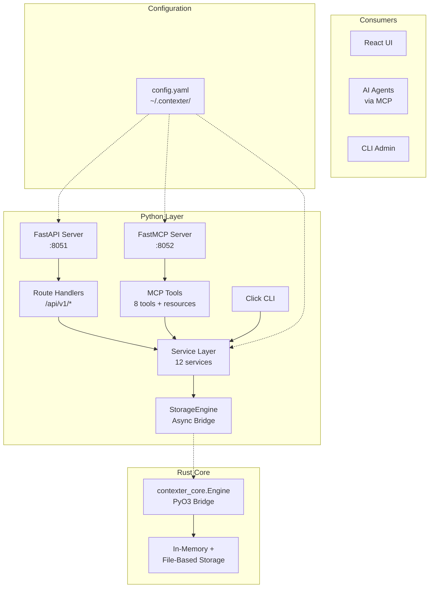
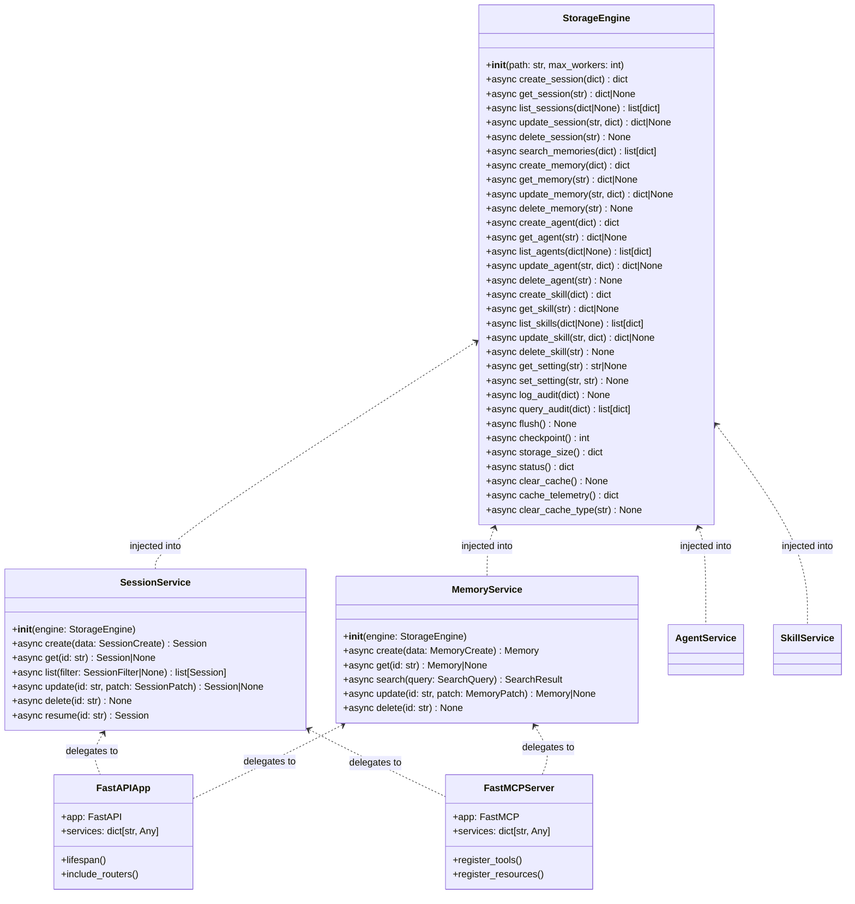

# Contexter — Python API Layer

> **Status:** `DRAFT — Pending Review` · **Version:** `v0.1.0-draft`
> **Feature:** 9 Tasks in 4 Groups · 4 Checkpoints · 4 Architecture Decisions

---

## Navigation

- [Problem Statement](#problem)
- [Design Options](#options)
- [System Design](#architecture)
- [Data Flow](#dataflow)
- [Open Questions](#questions)
- [Decision Log](#decisions)
- [API Contract](#api)
- [Out of Scope](#scope)
- [Acceptance Criteria](#ac)
- [Edge Cases](#edgecases)
- [Summary](#summary)

---

## Why This Feature Exists {#problem}

| The Pain | The Principle |
|---|---|
| Contexter's Rust core has no external interface — there is no REST API for the React UI to call, no MCP server for AI agents to interact with, and no CLI for admin diagnostics. Every new integration requires rebuilding from scratch. The existing `python/core_bridge.py` uses an incorrect import (`from contexter import Engine` instead of `from contexter_core import Engine`) and lacks TDD discipline. | "One gateway, many consumers." The Python layer is the official interface between the high-performance Rust engine and all external consumers. It enforces DDD ubiquitous language, test-first development, and observability-by-default so every integration is consistent, testable, and observable. |

---

## Design Options {#options}

### Option A — FastAPI + FastMCP (Chosen)

Dual-server architecture: FastAPI (REST, port 8051) for browser/SDK consumers + FastMCP (SSE, port 8052) for AI agent consumers. Shared service layer and bridge underneath.

| Advantages | Disadvantages |
|---|---|
| ✅ REST is universal — any client can call it | ❌ Running two servers increases operational complexity |
| ✅ MCP is the emerging standard for AI agent tool protocols | ❌ FastMCP is newer, less mature ecosystem |
| ✅ Shared service layer avoids code duplication | |
| ✅ FastAPI auto-generates OpenAPI docs for free | |
| ✅ SSE transport works through standard HTTP plumbing | |

### Option B — Single FastAPI Server Only

Only the REST server. AI agent integration would happen via REST-to-MCP adapters or custom wrappers.

| Advantages | Disadvantages |
|---|---|
| ✅ Simpler deployment — one server to manage | ❌ No native MCP protocol support |
| ✅ Fewer dependencies | ❌ Each AI agent integration needs custom adapter code |
| ✅ Faster startup | ❌ Loses MCP's structured tool/resource model |

### Option C — Python Wrapping via CLI Only

No persistent servers — a CLI tool invokes Rust operations and returns JSON to stdout. Consumers call the CLI as a subprocess.

| Advantages | Disadvantages |
|---|---|
| ✅ Simplest to implement | ❌ No persistent state — every call is cold start |
| ✅ No port management | ❌ Subprocess overhead on every operation |
| | ❌ No streaming or push notifications |
| | ❌ Concurrent access requires external queuing |
| | ❌ Not suitable for production web consumption |

**Chosen: Option A** — FastAPI + FastMCP dual-server architecture with shared service layer and DDD-aligned bridge.

---

## System Design {#architecture}

> **Status:** `Draft`

### High-Level Architecture



### Component Hierarchy

```
contexter-server/
├── pyproject.toml                  # Python project config + deps
├── src/
│   ├── __init__.py
│   ├── main.py                     # FastAPI app factory, lifespan, config
│   ├── mcp_server.py               # FastMCP server definition
│   ├── api/                        # FastAPI route handlers
│   │   ├── __init__.py
│   │   ├── sessions.py
│   │   ├── memories.py
│   │   ├── agents.py
│   │   ├── skills.py
│   │   ├── analytics.py
│   │   ├── efficiency.py
│   │   ├── search.py
│   │   ├── settings.py
│   │   ├── notifications.py
│   │   ├── audit.py
│   │   ├── files.py
│   │   ├── correlation.py
│   │   ├── export.py
│   │   ├── feedback.py
│   │   └── onboarding.py
│   ├── services/                   # Business logic orchestration
│   │   ├── __init__.py
│   │   ├── session_service.py
│   │   ├── memory_service.py
│   │   ├── agent_service.py
│   │   ├── skill_service.py
│   │   ├── analytics_service.py
│   │   ├── search_service.py
│   │   ├── export_service.py
│   │   ├── notification_service.py
│   │   ├── audit_service.py
│   │   ├── correlation_service.py
│   │   ├── onboarding_service.py
│   │   └── settings_service.py
│   ├── models/                     # Pydantic v2 domain models
│   │   ├── __init__.py
│   │   ├── session.py
│   │   ├── memory.py
│   │   ├── agent.py
│   │   ├── skill.py
│   │   ├── analytics.py
│   │   ├── settings.py
│   │   ├── audit.py
│   │   ├── search.py
│   │   ├── export.py
│   │   ├── correlation.py
│   │   └── notifications.py
│   ├── core/                       # Rust bridge wrapper
│   │   ├── __init__.py
│   │   └── bridge.py               # StorageEngine async wrapper
│   ├── mcp_tools/                  # MCP tool implementations
│   │   ├── __init__.py
│   │   ├── memory_tools.py
│   │   ├── session_tools.py
│   │   ├── agent_tools.py
│   │   ├── skill_tools.py
│   │   ├── health_tools.py
│   │   └── export_tools.py
│   └── cli/                        # CLI commands
│       ├── __init__.py
│       ├── main.py                  # Click group
│       ├── session_cmds.py
│       ├── memory_cmds.py
│       ├── admin_cmds.py
│       └── export_cmds.py
└── tests/                          # Mirror of src/ structure
    ├── conftest.py
    ├── models/
    ├── core/
    ├── services/
    ├── api/
    ├── mcp/
    ├── cli/
    └── integration/
```

### Module Architecture Diagram



### Data Model

All domain models as Pydantic v2 BaseModels with DDD ubiquitous language.

**Session**
```
id                     UUID    (required, auto-generated)
agent_id               UUID    (required, FK to agent)
project                str     (required)
name                   str     (optional)
status                 str     (enum: active, paused, completed, archived)
started_at             datetime (required, default=now)
updated_at             datetime (auto-updated)
completed_at           datetime (optional)
metadata               dict    (optional)
```

**Memory**
```
id                     UUID    (required, auto-generated)
session_id             UUID    (required, FK to session)
agent_id               UUID    (required, FK to agent)
role                   str     (enum: user, assistant, system, tool)
content                str     (required, large content via PyBytes >100KB)
tokens                 int     (optional)
tokenizer              str     (optional)
model                  str     (optional)
created_at             datetime (required, default=now)
metadata               dict    (optional)
```

**Agent**
```
id                     UUID    (required, auto-generated)
name                   str     (required)
provider               str     (enum: openai, anthropic, ollama, custom)
model                  str     (required)
system_prompt          str     (optional)
temperature            float   (optional, default=0.7)
max_tokens             int     (optional)
tools                  list[str] (optional)
metadata               dict    (optional)
created_at             datetime (required, default=now)
updated_at             datetime (auto-updated)
```

**Skill**
```
id                     UUID    (required, auto-generated)
name                   str     (required)
description            str     (optional)
type                   str     (enum: memory, search, reasoning, custom)
version                str     (optional)
parameters             dict    (optional)
enabled                bool    (default=True)
created_at             datetime (required, default=now)
updated_at             datetime (auto-updated)
```

---

## Data Flow {#dataflow}

### Flow 1: API Request → Response (Typical)

```
1. Client sends HTTP request to FastAPI :8051
       │
2. FastAPI middleware logs: method, path, client_ip
       │
3. Route handler validates request body via Pydantic model
       │
4. Route handler calls Service method (no business logic in route)
       │
5. Service performs validation, computes derived fields
       │
6. Service calls StorageEngine bridge method
       │
7. Bridge serializes dict → JSON string
       │
8. asyncio.to_thread() dispatches to ThreadPoolExecutor
       │
9. Rust Engine receives JSON, processes, returns JSON
       │
10. Bridge deserializes JSON → dict
       │
11. Service maps dict → Pydantic model
       │
12. Route handler returns Pydantic model → FastAPI serializes to JSON
       │
13. Middleware logs: duration, status_code
       │
14. Response sent to client (200/201/204/404/422/500)
```

### Flow 2: MCP Tool Call

```
1. AI agent sends MCP tool request to FastMCP :8052 (SSE)
       │
2. MCP router matches tool name
       │
3. Tool handler validates arguments
       │
4. Tool handler calls Service method
       │
5-6. Same as Flow 1 steps 5-10 (Service → Bridge → Rust)
       │
7. Tool handler formats response as MCP content
       │
8. Response sent back via SSE
```

### Flow 3: Large Content (>100KB) Path

```
1. MemoryService.create() detects content length > 100KB
       │
2. Bridge selects PyBytes path (not double JSON encode)
       │
3. Content sent as raw bytes to Rust Engine
       │
4. Rust engine stores content with byte fidelity
       │
5. On retrieval, Rust returns bytes → PyBytes → Python str
```

---

## Open Questions {#questions}

| ID | Question | Status |
|---|---|---|
| OQ-001 | Should the FastAPI and FastMCP servers run in the same process (uvicorn with lifespan) or separate processes? | 🔶 Debating |
| OQ-002 | For the large content PyBytes path: should the threshold of 100KB be configurable or hardcoded? | 🔶 Debating |
| OQ-003 | Should MCP resources be read-only, or should we support write resources (e.g., `contexter://memory/{id}/update`)? | ✅ Resolved — Read-only resources, write via tools |
| OQ-004 | Should the CLI be a standalone script or installed as an entry point via `pyproject.toml`? | ✅ Resolved — Entry point |
| OQ-005 | Rate limiting — should it be per-IP, per-token, or both? Implementation — middleware, per-route decorator, or nginx-level? | 🔶 Debating |

---

## Decision Log {#decisions}

| Date | ID | Description | Rationale |
|---|---|---|---|
| 2026-07-25 | DEC-001 | FastAPI on 8051, FastMCP on 8052 | Ports 8000-8050 taken; REST and MCP need dedicated ports for independent scaling |
| 2026-07-25 | DEC-002 | MCP transport = SSE (not stdio) | Client-server model, port-based, proper for MCP protocol |
| 2026-07-25 | DEC-003 | Bridge uses `asyncio.to_thread` + ThreadPoolExecutor | PyO3 calls release GIL but are sync; thread pool avoids event loop blocking |
| 2026-07-25 | DEC-004 | All endpoints under `/api/v1/` | Standard versioned prefix for future backward-compatible API evolution |
| 2026-07-25 | DEC-005 | Config at `~/.contexter/config.yaml` | Follows architecture spec Section 12; predictable location for all consumers |
| 2026-07-25 | DEC-006 | Bridge import: `from contexter_core import Engine` | Matches Cargo.toml `[lib] name = "contexter_core"` |
| 2026-07-25 | DEC-007 | Shared string content (≤100KB) via JSON, large (>100KB) via PyBytes | JSON path is simpler for typical content; PyBytes avoids double-encode overhead for large blobs |

---

## API Contract {#api}

> ⚠️ **Needs review:** Endpoint paths, request/response schemas require team sign-off.

### Sessions

**`POST /api/v1/sessions`** — Create session

**Request**
```json
{
  "agent_id": "uuid",
  "project": "contexter",
  "name": "Debugging Phase 3",
  "status": "active",
  "metadata": {}
}
```

**Response 201**
```json
{
  "id": "uuid",
  "agent_id": "uuid",
  "project": "contexter",
  "name": "Debugging Phase 3",
  "status": "active",
  "started_at": "2026-07-25T10:00:00Z",
  "updated_at": "2026-07-25T10:00:00Z",
  "completed_at": null,
  "metadata": {}
}
```

**Field Specification — Session**

| Field | Type | Required | Default | Constraints |
|---|---|---|---|---|
| `agent_id` | UUID | yes | — | Must reference existing agent |
| `project` | string | yes | — | 1-256 chars |
| `name` | string | no | null | 0-512 chars |
| `status` | string | no | `active` | enum: active, paused, completed, archived |
| `metadata` | dict | no | `{}` | Valid JSON object |

### Search

**`GET /api/v1/search?q=&type=&project=&page=&limit=`**

**Response 200**
```json
{
  "results": [{ "id": "uuid", "type": "memory", "score": 0.95, ... }],
  "total": 42,
  "page": 1,
  "limit": 20
}
```

### Settings

**`GET /api/v1/settings/:section`**

**Response 200**
```json
{
  "project": { "name": "my-project", "description": "..." },
  "storage": { "path": "~/.contexter/data", "autosave_interval_secs": 30 }
}
```

### MCP Tool Signatures

```
store_memory(args: {session_id, role, content, tokens?, tokenizer?, model?})
    → {memory_id, created_at}

search_memories(args: {query, type?, project?, limit?})
    → {results: [...], total}

get_session(args: {id})
    → {session} | error "Session not found"

list_recent_sessions(args: {limit?, project?})
    → {sessions: [...]}

get_agent_info(args: {id})
    → {agent} | error "Agent not found"

list_skills(args: {type?})
    → {skills: [...]}

get_system_health(args: {})
    → {status, uptime, memory_usage, storage_size}

export_data(args: {format?, entities?})
    → {export_id, status}
```

---

## Out of Scope {#scope}

| # | Item | Rationale |
|---|---|---|
| 01 | Database drivers / ORM in Python | All storage lives in the Rust engine — no SQL needed in Python |
| 02 | Authentication / authorization | Will be added in a later phase — Phase 3 is the API scaffold |
| 03 | WebSocket / real-time push | Not required by any current consumer; can be added via FastAPI WebSocket later |
| 04 | User management | No user concept yet — single-user mode |
| 05 | HTTPS / TLS | For local single-user use; reverse proxy handles TLS in production |
| 06 | Rate limiting | Not in scope for v1; middleware can be added later |

---

## Acceptance Criteria {#ac}

> **Status:** 26 Pending

| ID | Description | Status |
|---|---|---|
| AC-001 | Python project skeleton exists (`pyproject.toml`, `src/`, `tests/`) | 🔶 Pending |
| AC-002 | Maturin build config in `contexter-core/pyproject.toml` | 🔶 Pending |
| AC-003 | Module tree mirrors domain bounded contexts | 🔶 Pending |
| AC-004 | Pydantic models for all 11 entities | 🔶 Pending |
| AC-005 | Model validation tests pass | 🔶 Pending |
| AC-006 | Core bridge with `from contexter_core import Engine` | 🔶 Pending |
| AC-007 | Bridge CRUD operations work | 🔶 Pending |
| AC-008 | Bridge large content path (>100KB) | 🔶 Pending |
| AC-009 | Bridge tests pass | 🔶 Pending |
| AC-010 | Service layer for all 12 bounded contexts | 🔶 Pending |
| AC-011 | Service tests pass with mocked bridge | 🔶 Pending |
| AC-012 | FastAPI starts on port 8051 | 🔶 Pending |
| AC-013 | All endpoints under `/api/v1/` | 🔶 Pending |
| AC-014 | All endpoint groups exist per spec (16 groups) | 🔶 Pending |
| AC-015 | Route handlers delegate to service layer | 🔶 Pending |
| AC-016 | API tests pass (TestClient) | 🔶 Pending |
| AC-017 | MCP server starts on port 8052 (SSE) | 🔶 Pending |
| AC-018 | MCP tools: store_memory, search_memories, get_session, list_recent_sessions, get_agent_info, list_skills, get_system_health, export_data | 🔶 Pending |
| AC-019 | MCP resources: `contexter://session/{id}`, `contexter://memory/{id}`, `contexter://agent/{id}`, `contexter://analytics/overview` | 🔶 Pending |
| AC-020 | MCP tests pass | 🔶 Pending |
| AC-021 | Settings reads/writes `~/.contexter/config.yaml` with defaults | 🔶 Pending |
| AC-022 | CLI exists with core commands | 🔶 Pending |
| AC-023 | CLI tests pass | 🔶 Pending |
| AC-024 | Observability logging (requests, bridge calls, errors) | 🔶 Pending |
| AC-025 | Full test suite ≥90% coverage | 🔶 Pending |
| AC-026 | DDD ubiquitous language enforced (no "manager", "util", "helper") | 🔶 Pending |

---

## Edge Cases {#edgecases}

> **Status:** 40 Identified

| ID | Scenario | Expected Behavior | Priority |
|---|---|---|---|
| EC-001 | Rust Engine module not found | Clear ImportError with install instructions | High |
| EC-002 | Rust Engine version mismatch | AttributeError on missing methods — not silently swallowed | High |
| EC-003 | Content exactly at 100KB threshold | PyBytes path (not JSON) | Medium |
| EC-004 | Content just under 100KB | Normal JSON path | Medium |
| EC-005 | Binary/non-UTF8 content | PyBytes path handles; JSON path fails gracefully | High |
| EC-006 | Entity not found on get | Bridge: None → Service: None → API: 404 | High |
| EC-007 | Entity not found on update | Same as EC-006 | High |
| EC-008 | Delete non-existent entity | 204 (idempotent) | Medium |
| EC-009 | Empty list results | 200 `[]` | Medium |
| EC-010 | Search with empty results | 200 `{"results":[],"total":0}` | Medium |
| EC-011 | Search with regex metacharacters | Handle without error | Medium |
| EC-012 | Missing required fields in request | 422 with field-level errors | High |
| EC-013 | Wrong type in request field | 422 or coercion | High |
| EC-014 | Very large request body (>50MB) | 413 Payload Too Large | Medium |
| EC-015 | Concurrent create with same ID | One succeeds, one returns 409 | Medium |
| EC-016 | Config file corrupted YAML | Log warning, fall back to defaults | High |
| EC-017 | Config is a directory | Replace with file | Medium |
| EC-018 | Config write permission denied | Log warning, use in-memory defaults | Medium |
| EC-019 | Port 8051 already in use | Clear OSError log message | High |
| EC-020 | Port 8052 already in use | Clear OSError log message | High |
| EC-021 | MCP client disconnects mid-request | Graceful, no resource leak | Medium |
| EC-022 | MCP unknown tool | "tool not found" error response | Medium |
| EC-023 | MCP unknown resource | "resource not found" response | Medium |
| EC-024 | Bridge thread pool exhaustion (20 concurrent) | Queues, no crash, latency increases | Medium |
| EC-025 | Bridge call timeout (slow Rust op) | Timeout exception after configurable threshold | High |
| EC-026 | Analytics with no data | 200 with zeroed metrics | Medium |
| EC-027 | Division by zero in analytics | Guarded, returns 0 or null | High |
| EC-028 | Export with deleted entity mid-export | Failed export status | Medium |
| EC-029 | Export with very large dataset | Async, immediate 202, pollable | Medium |
| EC-030 | Rate limit on feedback | 429 after limit | Medium |
| EC-031 | Null byte in search query | 422 "contains null byte" | High |
| EC-032 | Empty string for entity ID | 404 or 422 | Medium |
| EC-033 | Very long entity ID (10K chars) | 422 (max 256 chars) | Medium |
| EC-034 | CLI with no config directory | Creates defaults on first invocation | Medium |
| EC-035 | CLI session create with invalid data | Click validation error + usage | High |
| EC-036 | SIGTERM graceful shutdown | Calls bridge flush() on shutdown | High |
| EC-037 | MCP malformed resource URI | Error response | Medium |
| EC-038 | Cache telemetry on empty cache | Zero counts, not error | Low |
| EC-039 | Concurrent notification list + delete | Snapshot at query time, no crash | Low |
| EC-040 | Semantic search with no embedding config | 400 or appropriate error | Medium |

---

## Design Draft Summary {#summary}

| Metric | Count |
|---|---|
| Acceptance Criteria | 26 |
| Edge Cases | 40 |
| Design Options | 3 (Option A chosen) |
| Open Questions | 5 |
| Decision Log Entries | 7 |
| Task Groups | 4 (A: 3 tasks, B: 1 task, C: 3 tasks, D: 2 tasks) |
| Checkpoints | 4 (A, B, C, D) |

This draft covers the Phase 3 Python API Layer for Contexter. Feedback is welcome on all sections above.

---

**Generated · 2026-07-25 · Contexter — Phase 3 Python API Layer Design Draft · v0.1.0-draft**

<!-- LOCKED: Template adapted from generate-design-documents draft-preview-template.md -->
