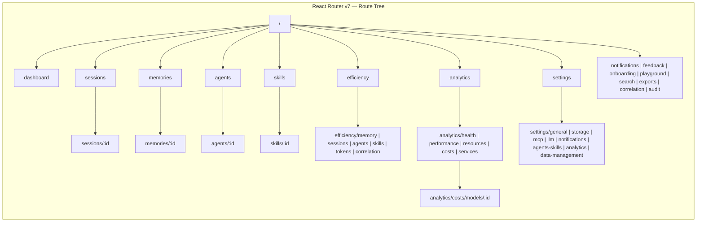

# Contexter Phase 4 — React UI Design Draft

> **Status:** `DRAFT — Pending Review` · **Version:** `v0.2.0-draft`
> **Feature:** 15 TDD-Driven Tasks · 38 Acceptance Criteria · 36 Edge Cases · 9 DDD Bounded Contexts

---

## Navigation

- [TDD Approach](#tdd)
- [DDD Approach](#ddd)
- [Architecture](#architecture)
- [Component Hierarchy](#components)
- [Route Map](#routes)
- [Data Flow](#dataflow)
- [Design Decisions](#decisions)
- [Wireframe — AppShell](#wireframe-appshell)
- [Wireframe — Dashboard](#wireframe-dashboard)
- [Wireframe — Session Detail](#wireframe-session-detail)
- [Wireframe — Efficiency Mapper](#wireframe-efficiency)
- [API Contract](#api)
- [Scope](#scope)
- [AC](#ac)
- [Edge Cases](#edgecases)
- [Summary](#summary)

---

## Test-Driven Development — Embedded in Every Task {#tdd}

> **Status:** `Non-Negotiable — Every Task`

Tests are **not** a separate deliverable at the end. Every implementation task in this plan follows the same TDD pattern:

### The TDD Contract (per Task)

```
For every component, hook, or page in this task:
  1. Write the test file first (*.test.tsx / *.test.ts)
  2. Watch it fail (red)
  3. Write the implementation until the test passes (green)
  4. Refactor while keeping tests green
  5. Move to next component
```

### What Tests Cover (per Component)

| Aspect | Required? | Example |
|--------|-----------|---------|
| Default render | ✅ Always | `Button renders with label text` |
| Variants | ✅ If component has variants | `Button renders primary/secondary/ghost/danger` |
| States | ✅ Loading, Empty, Error, Disabled | `DataTable shows skeleton rows when isLoading` |
| Interactions | ✅ If clickable/input | `Button fires onClick when clicked` |
| Edge cases | ✅ Boundary values | `Tag truncates text > 50 chars` |
| Accessibility | ✅ Keyboard + ARIA | `Modal traps focus, Esc dismisses` |

### Task 4.16 — Deleted

There is **no Task 4.16 "Test suite"**. Tests are produced alongside implementation in every task. The old approach made testing an afterthought — that was wrong.

### Worker Handoff — TDD Requirement

Every Worker delegation in BUILD will include in its "Skills to load" section:

```markdown
- `test-driven-development` — write test first, red-green-refactor
- `javascript-testing-patterns` — Vitest + Testing Library patterns  
- `verification-before-completion` — evidence tests pass before claiming done
```

And this instruction verbatim:

> **TDD is mandatory.** Before writing any implementation file, write its test file. The test must fail first (red), then pass after implementation (green), then you may refactor. No uncovered code is accepted. A task is not complete until `vitest run --reporter=verbose` shows all tests passing for every file touched.

---

## Domain-Driven Design — Ubiquitous Language & Bounded Contexts {#ddd}

> **Status:** `Non-Negotiable — Every Task`

### Bounded Contexts

The frontend is organized into bounded contexts that mirror the backend domain:

| Bounded Context | Route Prefix | Domain Language | What It Manages |
|----------------|-------------|-----------------|-----------------|
| **Session Context** | `/sessions` | Session, Turn, Message, Timeline | Session lifecycle, agent turns, conversation history |
| **Knowledge Context** | `/memories` | Memory, MemoryType, Version, Tag | Stored knowledge, semantic search, version history |
| **Agent Context** | `/agents` | Agent, Capability, Efficiency, Status | Agent registry, performance tracking |
| **Skill Context** | `/skills` | Skill, Category, Effectiveness, Usage | Skill registry, effectiveness metrics |
| **Observability Context** | `/analytics`, `/efficiency` | Metric, Health, Trend, Correlation | System metrics, efficiency scores, correlation analysis |
| **Configuration Context** | `/settings` | Section, Provider, Storage, LLM | System settings, provider configuration |
| **Notification Context** | `/notifications` | Notification, Priority, Channel | User notifications, alerting |
| **Feedback Context** | `/feedback` | BugReport, FeatureRequest, Changelog | User feedback, changelog |
| **Audit Context** | `/audit` | AuditEntry, Diff, Version | Change history, diffs |

### What DDD Means for Code

| Concern | Generic Approach (Rejected) | DDD Approach (Required) |
|---------|---------------------------|------------------------|
| Component names | `ListPage`, `DetailPage`, `CrudTable` | `SessionManagerPage`, `MemoryDetailPage`, `AgentCard` |
| Hook names | `useGet`, `useList`, `useCrud` | `useSessions`, `useAgent`, `useMemoryVersions` |
| Query keys | `['items']`, `['item', id]` | `['sessions', {status, project}]`, `['memory', id, 'versions']` |
| Route paths | `/items`, `/item/:id` | `/sessions`, `/sessions/:id` |
| Type names | `ListItem`, `DetailData` | `Session`, `Memory`, `Agent`, `Skill` |
| Prop names | `data`, `items`, `onSelect` | `session`, `memories`, `onSessionSelect` |
| Component files | `pages/Items/index.tsx` | `pages/Sessions/SessionManagerPage.tsx` |

### Ubiquitous Language Enforcement

Every file, function, type, and route must use the Contexter domain language. These terms are fixed:

```
Session (not "conversation", "chat", "thread")
Memory  (not "document", "record", "entry")
Agent   (not "bot", "assistant", "worker")
Skill   (not "plugin", "tool", "capability")
Turn    (not "message exchange", "round")
Efficiency (not "score", "metric")
```

A code reviewer flagging a generic term like `ListItem` or `useGetData` in a bounded context should reject it with: *"What domain entity is this? Use the ubiquitous language."*

### Worker Handoff — DDD Requirement

Every Worker delegation will include:

```markdown
- `domain-driven-design` — bounded contexts, ubiquitous language
```

And this instruction:

> **DDD is mandatory.** Component names, file names, hooks, types, props, and routes must use the Contexter ubiquitous language. Each page module represents a bounded context. No generic names (`ListPage`, `DetailPage`, `useCrud`, `data`, `items`). If you find yourself writing a generic abstraction, stop and ask: "What domain entity am I modeling?"

---

## System Architecture {#architecture}

> **Status:** `Draft`

### Component Architecture

```mermaid
graph TD
    subgraph "React SPA (contexter-web)"
        App[App.tsx<br/>QueryClientProvider + RouterProvider]
        AS[AppShell<br/>Sidebar + TopBar + Outlet]
        
        subgraph "Shared Components"
            UI[UI Primitives<br/>Button, Badge, Input...]
            Data[Data Display<br/>DataTable, StatCard, Tag...]
            Filter[Filters<br/>TimeframeFilter, SearchInput...]
            Feedback[Feedback<br/>Modal, Toast, EmptyState]
        end
        
        subgraph "Pages"
            DASH[/dashboard]
            SESS[/sessions + /sessions/:id]
            MEM[/memories + /memories/:id]
            AGT[/agents + /agents/:id]
            SKL[/skills + /skills/:id]
            EFF[/efficiency + 6 sub-pages]
            ANL[/analytics + 6 sub-pages]
            SET[/settings + 8 sections]
            EXT[Search, Exports, Notifications,<br/>Feedback, Onboarding, Playground,<br/>Correlation, Audit]
        end
        
        subgraph "Data Layer"
            API[api/client.ts<br/>Typed fetch wrapper]
            Hooks[React Query Hooks<br/>useSessions, useMemories...]
        end
        
        App --> AS
        AS --> DASH & SESS & MEM & AGT & SKL & EFF & ANL & SET & EXT
        DASH & SESS & MEM & AGT & SKL & EFF & ANL & SET & EXT --> Hooks
        Hooks --> API
        AS --> UI & Data & Filter & Feedback
        DASH & SESS & MEM & AGT & SKL & EFF --> UI & Data & Filter & Feedback
    end

    subgraph "Backend (port 8051)"
        REST[FastAPI<br/>REST API /api/v1]
    end

    subgraph "MCP (port 8052)"
        MCP[FastMCP Server]
    end

    API -->|HTTP fetch| REST
    API -.->|Alternative| MCP
```

### Route Architecture



---

## Component Hierarchy {#components}

### Layout Components
```
AppShell
├── SidebarNav (collapsible, 240px/60px)
│   ├── NavItem (icon + label, active state)
│   └── NavSection (label for grouped items)
├── TopBar
│   ├── Breadcrumb
│   ├── SearchTrigger (⌘K)
│   ├── NotificationBell (unread badge)
│   └── UserAvatar
└── Content (Outlet)
    ├── PageHeader (title + breadcrumbs + actions)
    └── PageContent
```

### Shared UI Primitives
```
Button (primary/secondary/ghost/danger · default/sm/lg)
Badge (success/warning/error/info/pending/offline)
Input (default/error/disabled · with optional icon/label)
DataTable (sortable headers · hover rows · pagination)
StatCard (value + label ± trend indicator)
Modal (overlay + surface + close + optional title/footer)
Toast (success/error/info/warning · auto-dismiss)
Tag (colored label badge)
ToggleChip (pill toggle · active=accent)
EmptyState (illustration + message + CTA)
LoadingSkeleton (pulsing rectangles)
TimeframeFilter (dropdown + custom date picker)
SearchInput (input + clear + optional icon)
FilterBar (row of selects + search)
TabBar (horizontal tab navigation)
EntityLink (purple #7C5CFC link)
```

---

## Route Map {#routes}

| Route | Page Component | Parent | Data Hook |
|-------|---------------|--------|-----------|
| `/dashboard` | `DashboardPage` | AppShell | `useDashboardStats()` |
| `/sessions` | `SessionManagerPage` | AppShell | `useSessions(filter)` |
| `/sessions/:id` | `SessionDetailPage` | AppShell | `useSession(id)` |
| `/memories` | `MemoryExplorerPage` | AppShell | `useMemories(filter)` |
| `/memories/:id` | `MemoryDetailPage` | AppShell | `useMemory(id)` |
| `/agents` | `AgentRegistryPage` | AppShell | `useAgents(filter)` |
| `/agents/:id` | `AgentDetailPage` | AppShell | `useAgent(id)` |
| `/skills` | `SkillRegistryPage` | AppShell | `useSkills(filter)` |
| `/skills/:id` | `SkillDetailPage` | AppShell | `useSkill(id)` |
| `/efficiency` | `EfficiencyMapperPage` | AppShell | `useEfficiency(timeframe)` |
| `/efficiency/memory` | `MemoryUsagePage` | AppShell | `useEfficiencyMemory(timeframe)` |
| `/efficiency/sessions` | `SessionActivityPage` | AppShell | `useEfficiencySessions(timeframe)` |
| `/efficiency/agents` | `AgentPerformancePage` | AppShell | `useEfficiencyAgents(timeframe)` |
| `/efficiency/skills` | `SkillEffectivenessPage` | AppShell | `useEfficiencySkills(timeframe)` |
| `/efficiency/tokens` | `TokenUsagePage` | AppShell | `useEfficiencyTokens(timeframe)` |
| `/efficiency/correlation` | `CorrelationMatrixPage` | AppShell | `useEfficiencyCorrelation(timeframe)` |
| `/analytics` | `AnalyticsOverviewPage` | AppShell | `useAnalyticsOverview(timeframe)` |
| `/analytics/health` | `SystemHealthPage` | AppShell | `useAnalyticsHealth()` |
| `/analytics/performance` | `PerformanceTrendsPage` | AppShell | `useAnalyticsPerformance(timeframe)` |
| `/analytics/resources` | `ResourceUsagePage` | AppShell | `useAnalyticsResources()` |
| `/analytics/costs` | `CostAnalyticsPage` | AppShell | `useAnalyticsCosts(timeframe)` |
| `/analytics/costs/models/:id` | `ModelDetailPage` | AppShell | `useAnalyticsModelDetail(id)` |
| `/analytics/services` | `ServiceStatusPage` | AppShell | `useAnalyticsServices()` |
| `/settings` | Redirect → `/settings/general` | AppShell | — |
| `/settings/general` | `GeneralSettingsPage` | AppShell | `useSettings('general')` |
| `/settings/storage` | `StorageSettingsPage` | AppShell | `useSettings('storage')` |
| `/settings/mcp` | `MCPSettingsPage` | AppShell | `useSettings('mcp')` |
| `/settings/llm` | `LLMSettingsPage` | AppShell | `useSettings('llm')` |
| `/settings/notifications` | `NotificationSettingsPage` | AppShell | `useSettings('notifications')` |
| `/settings/agents-skills` | `AgentSkillSettingsPage` | AppShell | `useSettings('agents-skills')` |
| `/settings/analytics` | `AnalyticsSettingsPage` | AppShell | `useSettings('analytics')` |
| `/settings/data-management` | `DataManagementPage` | AppShell | `useSettings('data-management')` |
| `/notifications` | `NotificationCenterPage` | AppShell | `useNotifications()` |
| `/feedback` | `FeedbackPage` | AppShell | — |
| `/onboarding` | `OnboardingPage` | AppShell | `useOnboardingStatus()` |
| `/playground` | `APIPlaygroundPage` | AppShell | — |
| `/search` | `SearchPage` | AppShell | `useSearch(query)` |
| `/exports` | `ExportPage` | AppShell | `useExports()` |
| `/correlation` | `CorrelationPage` | AppShell | `useCorrelation()` |
| `/audit` | `AuditPage` | AppShell | `useAudit()` |
| `*` | `NotFoundPage` | AppShell | — |

---

## Data Flow {#dataflow}

### Standard Data Flow (List Pages)

```
1. User navigates to /sessions
2. SessionManagerPage mounts → calls useSessions({status, project})
3. useSessions checks TanStack Query cache
4. Cache miss → api.get('/sessions?status=active') fires
5. fetch() sends GET to http://localhost:8051/api/v1/sessions?status=active
6. Response returns → TanStack Query caches + returns typed data
7. DataTable re-renders with session rows
8. Any filter change → query key updates → automatic refetch
```

### Mutation Flow (CRUD)

```
1. User clicks "Delete" on a session row
2. Confirmation Modal appears → user confirms
3. useDeleteSession mutation fires
4. onMutate: optimistic removal from cache
5. api.delete('/sessions/{id}') fires
6. On success: onSettled invalidates queries → UI refreshes
7. On error: onError rolls back optimistic update → error toast
```

### Dashboard Flow

```
1. User navigates to /dashboard
2. DashboardPage calls useDashboardStats()
3. Hook fires parallel GETs to 3 endpoints:
   - GET /sessions (count, active count)
   - GET /memories (count)
   - GET /efficiency/overview (avg efficiency)
4. All 3 resolve → StatCards render with values + trends
5. Recent Sessions table renders from cached /sessions data
6. Quick Actions render as static card buttons with Link navigation
```

---

## Design Decisions {#decisions}

| ID | Decision | Choice | Rationale |
|----|----------|--------|-----------|
| D-001 | CSS Framework | Tailwind v4 + CSS custom properties | Design tokens map to CSS vars. No runtime CSS-in-JS. |
| D-002 | State Management | TanStack Query + local React state | All UI state derives from server state. No Redux needed. |
| D-003 | Routing | React Router v7 | Standard de facto choice for React SPAs. Flat route config. |
| D-004 | Icons | Lucide React | Specified in V2-DEEP design system. Consistent 1.5px stroke. |
| D-005 | Charts | Recharts | Composable React chart primitives. Covers line, bar, area, pie, radar. |
| D-006 | HTTP Client | Native fetch() wrapper | API surface is well-known. Axios adds unnecessary weight. |
| D-007 | Date Formatting | date-fns | Tree-shakeable. Covers all formatting, relative time, and timezone needs. |
| D-008 | Testing | Vitest + Testing Library + MSW | Fast Vitest runner + RTL for component tests + MSW for API mocking. |
| D-009 | Design Approach | Domain-Driven Design (DDD) | Frontend mirrors backend domain: bounded contexts (Session, Knowledge, Agent, Skill, Observability), ubiquitous language in every file/type/hook/prop. Rejects generic CRUD abstractions. |
| D-010 | Development Methodology | Test-Driven Development (TDD) | Every component, hook, and page is test-first: red (write test) → green (implement) → refactor. No test = incomplete. No Task 4.16 — tests are embedded in every task. |
| D-011 | Project Structure | Feature folders under pages/ | Each page group is a bounded context. Shared code in components/, api/, hooks/. |

### Folder Structure — TDD + DDD Reflected

Tests are colocated with implementation (preferred for TDD) or in a parallel `__tests__/` mirror. MSW handlers use domain language fixtures.

```
contexter-web/
├── index.html
├── package.json
├── vite.config.ts
├── tsconfig.json
├── tailwind.config.ts
├── postcss.config.js
├── src/
│   ├── main.tsx                          # Entry point
│   ├── App.tsx                           # QueryClientProvider + RouterProvider
│   ├── routes.tsx                        # All route definitions
│   ├── styles/
│   │   ├── tokens.css                    # V2-DEEP design tokens
│   │   └── tokens.test.css               # Token value snapshot test
│   ├── api/
│   │   ├── client.ts                     # Typed fetch wrapper
│   │   ├── client.test.ts                # Client unit tests
│   │   └── hooks/                        # React Query hooks (per bounded context)
│   │       ├── useSessions.ts
│   │       ├── useSessions.test.ts       # TDD: written before implementation
│   │       ├── useMemories.ts
│   │       ├── useMemories.test.ts
│   │       ├── useAgents.ts
│   │       ├── useAgents.test.ts
│   │       ├── useSkills.ts
│   │       └── useSkills.test.ts
│   ├── components/
│   │   ├── layout/
│   │   │   ├── AppShell.tsx
│   │   │   ├── AppShell.test.tsx          # Layout render, collapse, navigation
│   │   │   ├── SidebarNav.tsx
│   │   │   ├── SidebarNav.test.tsx         # Nav items, active state, collapse
│   │   │   ├── TopBar.tsx
│   │   │   └── TopBar.test.tsx             # Breadcrumbs, bell, search trigger
│   │   ├── ui/                            # DDD-neutral primitives (design system)
│   │   │   ├── Button.tsx
│   │   │   ├── Button.test.tsx             # TDD: variants, click, disabled, loading
│   │   │   ├── Badge.tsx
│   │   │   ├── Badge.test.tsx              # All status colors
│   │   │   ├── DataTable.tsx
│   │   │   ├── DataTable.test.tsx          # Sort, paginate, empty, loading
│   │   │   ├── Modal.tsx
│   │   │   ├── Modal.test.tsx              # Open, close, focus trap, Esc
│   │   │   ├── EmptyState.tsx
│   │   │   ├── Toast.tsx
│   │   │   ├── Toast.test.tsx              # Variants, auto-dismiss
│   │   │   └── ...
│   │   └── shared/                        # Domain-aware shared components
│   │       ├── StatCard.tsx
│   │       ├── StatCard.test.tsx
│   │       ├── FilterBar.tsx
│   │       ├── TimeframeFilter.tsx
│   │       └── EntityLink.tsx
│   └── pages/                             # Bounded contexts (DDD)
│       ├── Dashboard/                     # [No bounded context — cross-cutting]
│       │   ├── DashboardPage.tsx
│       │   └── DashboardPage.test.tsx
│       ├── Sessions/                      # Session Context
│       │   ├── SessionManagerPage.tsx
│       │   ├── SessionManagerPage.test.tsx
│       │   ├── SessionDetailPage.tsx
│       │   ├── SessionDetailPage.test.tsx
│       │   └── components/               # Session-context specific components
│       │       ├── TurnTimeline.tsx
│       │       ├── TurnTimeline.test.tsx
│       │       └── MessageBubble.tsx
│       ├── Memories/                      # Knowledge Context
│       │   ├── MemoryExplorerPage.tsx
│       │   ├── MemoryExplorerPage.test.tsx
│       │   ├── MemoryDetailPage.tsx
│       │   └── MemoryDetailPage.test.tsx
│       ├── Agents/                        # Agent Context
│       │   ├── AgentRegistryPage.tsx
│       │   ├── AgentRegistryPage.test.tsx
│       │   ├── AgentDetailPage.tsx
│       │   └── AgentDetailPage.test.tsx
│       ├── Skills/                        # Skill Context
│       │   ├── SkillRegistryPage.tsx
│       │   └── SkillDetailPage.tsx
│       ├── Efficiency/                    # Observability Context (sub)
│       │   └── ...
│       ├── Analytics/                     # Observability Context (sub)
│       │   └── ...
│       ├── Settings/                      # Configuration Context
│       │   └── ...
│       ├── Notifications/                 # Notification Context
│       ├── Feedback/                      # Feedback Context
│       ├── Onboarding/
│       ├── Playground/
│       ├── Search/
│       ├── Exports/
│       ├── Correlation/
│       ├── Audit/                         # Audit Context
│       └── NotFound.tsx
└── tests/
    ├── setup.ts                           # MSW server + test setup
    └── mocks/
        ├── handlers/                      # MSW handlers per domain (DDD)
        │   ├── sessions.ts
        │   ├── memories.ts
        │   ├── agents.ts
        │   ├── skills.ts
        │   ├── analytics.ts
        │   ├── settings.ts
        │   └── ...
        └── factories/                     # Domain-aware test factories
            ├── sessionFactory.ts
            ├── memoryFactory.ts
            ├── agentFactory.ts
            └── skillFactory.ts
```

---

## Wireframe — AppShell {#wireframe-appshell}

```
┌──────────────┬─────────────────────────────────────────────┬──────┐
│   SIDEBAR    │                 TOP BAR                     │  ❌  │
│   (240px)    │  Sessions  >  Detail  >  [⌘K]  [🔔]  [👤]  │      │
│  ─────────── │─────────────────────────────────────────────┤      │
│              │                                              │      │
│  ◻ Dashboard │                                              │      │
│  ◉ Sessions  │         <Outlet /> — Page Content            │      │
│  ○ Memories  │                                              │      │
│  ○ Agents    │         Renders active route's page          │      │
│  ○ Skills    │                                              │      │
│  ○ Analytics │                                              │      │
│              │                                              │      │
│  ─────────── │                                              │      │
│  ⚙ Settings  │                                              │      │
│              │                                              │      │
│  [<=]        │                                              │      │
│  collapse    │                                              │      │
└──────────────┴─────────────────────────────────────────────┴──────┘

Sidebar states:
  Expanded (240px): Icons + labels visible, active item has purple left border
  Collapsed (60px): Icons only, labels hidden on hover via tooltip
```

---

## Wireframe — Dashboard {#wireframe-dashboard}

```
┌─────────────────────────────────────────────────────────────────┐
│  Dashboard                                         [Timeframe]  │
│                                                                  │
│  ┌──────────┐  ┌──────────┐  ┌──────────┐  ┌──────────┐        │
│  │ 1,247    │  │ 38       │  │ 8,432    │  │ 87%      │        │
│  │ Sessions │  │ Active   │  │ Memories │  │ Avg Eff  │        │
│  │ ▲ 12%    │  │ ▼ 3%    │  │ ▲ 8%     │  │ ▲ 2%    │        │
│  └──────────┘  └──────────┘  └──────────┘  └──────────┘        │
│                                                                  │
│  Recent Sessions                                    [View All →] │
│  ┌──────────────────────────────────────────────────────────────┐│
│  │ ID          Agent    Status   Duration  Turns  Last Active  ││
│  │ ses_abc     Helper   ● Active  12m      34     2m ago       ││
│  │ ses_def     Coder    ● Done    8m       18     15m ago      ││
│  │ ses_ghi     Helper   ● Error   3m       5      1h ago       ││
│  └──────────────────────────────────────────────────────────────┘│
│                                                                  │
│  Quick Actions                                                    │
│  ┌──────────────┐  ┌──────────────┐  ┌──────────────┐           │
│  │ 🚀 Launch    │  │ 🔍 Explore   │  │ 📊 View      │           │
│  │   Session    │  │   Memories   │  │   Analytics  │           │
│  └──────────────┘  └──────────────┘  └──────────────┘           │
└─────────────────────────────────────────────────────────────────┘
```

---

## Wireframe — Session Detail {#wireframe-session-detail}

```
┌─────────────────────────────────────────────────────────────────┐
│  Sessions  >  ses_abc                            [Resume] [⋮]  │
│                                                                  │
│  Session ID: ses_abc  Status: ● Active                           │
│  Agent: Helper         Project: contexter                        │
│  Created: 2h ago       Duration: 12m  Turns: 34                 │
│                                                                  │
│  ┌──────────┬──────────┬──────────┬──────────┐                  │
│  │  Timeline │ Messages │ Memories │ Metadata │                  │
│  ├──────────┴──────────┴──────────┴──────────┤                  │
│  │                                            │                  │
│  │  ┌─── Turn 1 ──────────────────────────┐   │                  │
│  │  │  User: "Initialize project"         │   │                  │
│  │  │  Helper ● 2s latency                │   │                  │
│  │  │  "Setting up project structure..."  │   │                  │
│  │  └─────────────────────────────────────┘   │                  │
│  │  ┌─── Turn 2 ──────────────────────────┐   │                  │
│  │  │  User: "Add authentication"         │   │                  │
│  │  │  Helper ● 3s latency                │   │                  │
│  │  │  "Adding auth middleware..."         │   │                  │
│  │  └─────────────────────────────────────┘   │                  │
│  │                                            │                  │
│  └────────────────────────────────────────────┘                  │
└─────────────────────────────────────────────────────────────────┘
```

---

## Wireframe — Efficiency Mapper {#wireframe-efficiency}

```
┌─────────────────────────────────────────────────────────────────┐
│  Efficiency Mapper                              [Last 7 days ▾] │
│                                                                  │
│  ┌──────────┐  ┌──────────┐  ┌──────────┐  ┌──────────┐        │
│  │ 87%      │  │ +12%     │  │ 245      │  │ 14m      │        │
│  │ Avg Eff  │  │ Trend    │  │ Avg Tok  │  │ Avg Dur  │        │
│  └──────────┘  └──────────┘  └──────────┘  └──────────┘        │
│                                                                  │
│  ┌──────────────────┐  ┌──────────────────┐                     │
│  │ 📊 Memory Usage  │  │ 📈 Session       │                     │
│  │ 68% used         │  │ Activity          │                     │
│  │ ════▌░░░░ 68%    │  │ ╱╲╱╲╱▔╲╱╲  142   │                     │
│  │ ▲ 5% from last   │  │ ▼ 8% from last   │                     │
│  └──────────────────┘  └──────────────────┘                     │
│                                                                  │
│  ┌──────────────────┐  ┌──────────────────┐                     │
│  │ 🤖 Agent         │  │ 🧩 Skill          │                     │
│  │ Performance       │  │ Effectiveness     │                     │
│  │ ╱╲╱╲╱╲╱╲  91%   │  │ ════╗░░░  72%    │                     │
│  │ ▲ 3% from last   │  │ ▼ 2% from last   │                     │
│  └──────────────────┘  └──────────────────┘                     │
│                                                                  │
│  ┌──────────────────┐  ┌──────────────────┐                     │
│  │ 💰 Token Usage   │  │ 🔗 Correlation    │                     │
│  │ 245K total       │  │ Matrix             │                     │
│  │ ╱╲╱▔╲╱╲╱▔╲ 245K │  │ ▦▦▦▤▤▥▥  r=0.74  │                     │
│  │ ▲ 15% from last  │  │ Strong            │                     │
│  └──────────────────┘  └──────────────────┘                     │
└─────────────────────────────────────────────────────────────────┘

  Timeframe filter (top right) controls ALL cards simultaneously.
  Each card → click navigates to its detail page.
```

---

## API Contract {#api}

> This contract mirrors the existing REST API on port 8051. All endpoints below are already implemented in Phase 3. The React UI consumes them as-is.

### Base Configuration

```
Base URL: http://localhost:8051/api/v1
Headers:
  Content-Type: application/json
  X-API-Key: <configured in settings>
```

### Session Endpoints

| Method | Path | Hook | Description |
|--------|------|------|-------------|
| GET | `/sessions` | `useSessions(filter)` | List sessions |
| POST | `/sessions` | `useCreateSession()` | Create session |
| GET | `/sessions/{id}` | `useSession(id)` | Get session |
| PUT | `/sessions/{id}` | `useUpdateSession()` | Update session |
| DELETE | `/sessions/{id}` | `useDeleteSession()` | Delete session |
| POST | `/sessions/{id}/resume` | `useResumeSession()` | Resume session |

**GET /sessions response:**
```json
[
  {
    "id": "ses_abc123",
    "project": "contexter",
    "agent": "Helper",
    "status": "active",
    "duration_minutes": 12.5,
    "turn_count": 34,
    "created_at": "2026-07-26T10:00:00Z",
    "last_active": "2026-07-26T10:12:00Z"
  }
]
```

### Memory Endpoints

| Method | Path | Hook | Description |
|--------|------|------|-------------|
| GET | `/memories` | `useMemories(filter)` | List memories |
| POST | `/memories` | `useCreateMemory()` | Create memory |
| GET | `/memories/search` | `useMemorySearch(query)` | Search memories |
| GET | `/memories/{id}` | `useMemory(id)` | Get memory |
| PUT | `/memories/{id}` | `useUpdateMemory()` | Update memory |
| DELETE | `/memories/{id}` | `useDeleteMemory()` | Delete memory |

### Agent & Skill Endpoints

| Method | Path | Hook | Description |
|--------|------|------|-------------|
| GET | `/agents` | `useAgents(filter)` | List agents |
| POST | `/agents` | `useCreateAgent()` | Create agent |
| GET | `/agents/{id}` | `useAgent(id)` | Get agent |
| GET | `/skills` | `useSkills(filter)` | List skills |
| GET | `/skills/{id}` | `useSkill(id)` | Get skill |

### Analytics & Efficiency Endpoints

| Method | Path | Hook |
|--------|------|------|
| GET | `/analytics/overview` | `useAnalyticsOverview(timeframe)` |
| GET | `/analytics/health` | `useAnalyticsHealth()` |
| GET | `/analytics/performance` | `useAnalyticsPerformance(timeframe)` |
| GET | `/efficiency/overview` | `useEfficiencyOverview(timeframe)` |
| GET | `/efficiency/memory` | `useEfficiencyMemory(timeframe)` |
| GET | `/efficiency/sessions` | `useEfficiencySessions(timeframe)` |
| GET | `/efficiency/agents` | `useEfficiencyAgents(timeframe)` |
| GET | `/efficiency/skills` | `useEfficiencySkills(timeframe)` |
| GET | `/efficiency/tokens` | `useEfficiencyTokens(timeframe)` |
| GET | `/efficiency/correlation` | `useEfficiencyCorrelation(timeframe)` |

### Settings Endpoints

| Method | Path | Hook |
|--------|------|------|
| GET | `/settings/{section}` | `useSettings(section)` |
| PUT | `/settings/{section}` | `useUpdateSettings()` |

### Other Endpoints

| Method | Path | Hook |
|--------|------|------|
| GET | `/search?q=` | `useSearch(query)` |
| GET | `/notifications` | `useNotifications()` |
| PUT | `/notifications/{id}/read` | `useMarkNotificationRead()` |
| POST | `/notifications/read-all` | `useMarkAllRead()` |
| POST | `/feedback/bug` | `useSubmitBugReport()` |
| POST | `/feedback/suggest` | `useSubmitSuggestion()` |
| GET | `/changelog` | `useChangelog()` |
| GET | `/export/history` | `useExportHistory()` |
| POST | `/export/submit` | `useSubmitExport()` |
| GET | `/correlation/overview` | `useCorrelationOverview()` |
| GET | `/correlation/timeline` | `useCorrelationTimeline()` |
| GET | `/correlation/compare` | `useCorrelationCompare()` |
| GET | `/audit` | `useAudit()` |
| GET | `/onboarding/status` | `useOnboardingStatus()` |
| POST | `/onboarding/wizard` | `useSubmitOnboarding()` |

---

## Out of Scope {#scope}

| # | Item | Rationale |
|---|------|-----------|
| 01 | Light mode | Dark-only per V2-DEEP spec. Light mode would be a future v2. |
| 02 | Mobile-native app | Phase 4 is a responsive SPA. React Native would be a separate phase. |
| 03 | End-to-end Playwright tests | E2E tests deferred post-MVP. Unit + integration test coverage required. |
| 04 | Real-time WebSocket updates | Notifications use polling. WebSocket integration deferred. |
| 05 | Drag-and-drop components | No drag-and-drop interactions in v1 spec. |
| 06 | File upload UI | File management exists via API but UI is read-only in v1. |
| 07 | Multi-user auth UI | User management deferred. Single-user mode with API key auth. |

---

## Acceptance Criteria {#ac}

> **Status:** 38 Pending

All 38 acceptance criteria are defined in `ACCEPTANCE.md`. They cover:

| Group | Count | Key ACs | TDD/DDD Notes |
|-------|-------|---------|---------------|
| Foundation | 3 | AC-001 to AC-003 — scaffold, tokens, components | TDD for every component; DDD naming enforced |
| AppShell | 5 | AC-004 to AC-008 — sidebar, navigation, routes, 404 | Tests for collapse, active state, keyboard nav |
| API + Hooks | 3 | AC-009 to AC-011 — client, hooks, errors | Hooks named per domain: `useSessions`, `useMemory`, `useAgent` |
| Core Pages | 11 | AC-012 to AC-022 — dashboard, sessions, memories, agents, skills, efficiency | Each page is a DDD bounded context; test-first per page |
| Analytics | 2 | AC-023 to AC-024 — overview + sub-pages | Data hooks use domain query keys |
| Settings | 2 | AC-025 to AC-026 — sidebar nav + save | Settings hook uses section key |
| Standalone | 8 | AC-027 to AC-034 — search, playground, notifications, feedback, exports, onboarding, correlation, audit | Each is a bounded-context page module with co-located tests |
| Quality | 4 | AC-035 to AC-038 — component, hook, route, coverage | Enforced by TDD: every task produces tests, no "test week" |

---

## Edge Cases {#edgecases}

> **Status:** 36 Identified

| Category | Count | IDs |
|----------|-------|-----|
| Network & API Failures | 6 | EC-001 to EC-006 |
| Data & State | 7 | EC-007 to EC-013 |
| UI & Interaction | 7 | EC-014 to EC-020 |
| Settings | 3 | EC-021 to EC-023 |
| Analytics & Charts | 4 | EC-024 to EC-027 |
| Export & Correlation | 4 | EC-028 to EC-031 |
| Notification & Feedback | 3 | EC-032 to EC-034 |
| Onboarding | 2 | EC-035 to EC-036 |

Full details in `EDGE_CASES.md`.

---

## Design Draft Summary {#summary}

| Metric | Count |
|--------|-------|
| TDD-Driven Implementation Tasks | 15 (every task produces tests first) |
| Acceptance Criteria | 38 |
| Edge Cases | 36 |
| Routes | 39 |
| Shared Components | 18 |
| Test Files (co-located) | 25+ (one per component/hook/page) |
| React Query Hooks | 25+ |
| DDD Bounded Contexts | 9 (Session, Knowledge, Agent, Skill, Observability, Config, Notification, Feedback, Audit) |
| Mockup HTML Files | 40+ (pre-approved) |
| Test Runner | Vitest + Testing Library + MSW |

This draft covers the complete Contexter Phase 4 React UI. Two major additions since v0.1.0:

1. **TDD is now embedded in every task** — no separate "test suite" task. Every component, hook, and page is test-first (red → green → refactor). Tests cover render, variants, states, interactions, edge cases, and accessibility.

2. **DDD is now the structural foundation** — 9 bounded contexts with ubiquitous language enforced across all file names, component names, hook names, types, props, and routes. Generic CRUD patterns are rejected in favor of domain-driven naming.

The V2-DEEP design system, all mockups, UI design specs, and page layouts have been reviewed and approved in prior sessions.

---

**Generated · 2026-07-26 · Contexter Phase 4 — React UI Design Draft · v0.1.0-draft**
