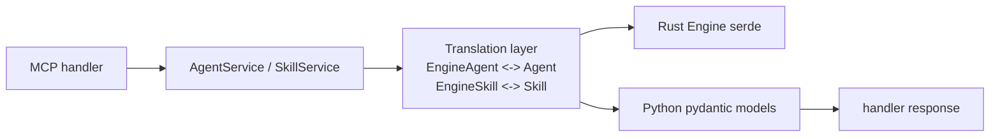

# Preview — Agent/Skill Schema Drift Repair

## Approach

Add translation layer mirroring `memory_service.py`: engine `type`/`capabilities` map to pydantic `Agent` (provider/model derived or made optional); skill `category` mapped to `type`; `version` int↔str harmonized; `SkillFilter` type filter enforced in translation if engine drops it.

## Fix boundary
`models/agent.py`, `models/skill.py`, `services/agent_service.py`, `services/skill_service.py`, + TDD tests (live engine).

## Acceptance mapping
AC-AG-001..003, AC-SK-001..003, EC-AG-001..004, EC-SK-001..004, EC-RS-001..002.
