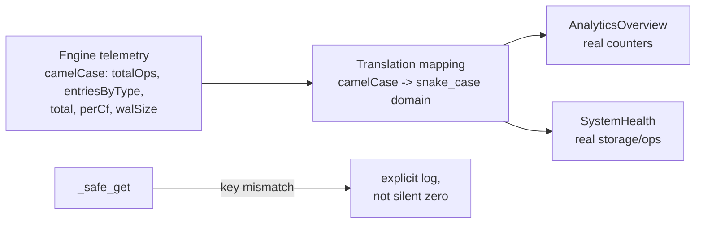

# Preview — Analytics/Health Telemetry Mapping Repair

## Approach

Add explicit key mapping in analytics/health services; `_safe_get` logs missing keys at debug/warn instead of silent zero.

## Fix boundary
`services/analytics_service.py` (or health handler), `_safe_get` helper, + TDD tests (seed → non-zero counters).

## Acceptance mapping
AC-AN-001..003, EC-AN-001..005.
