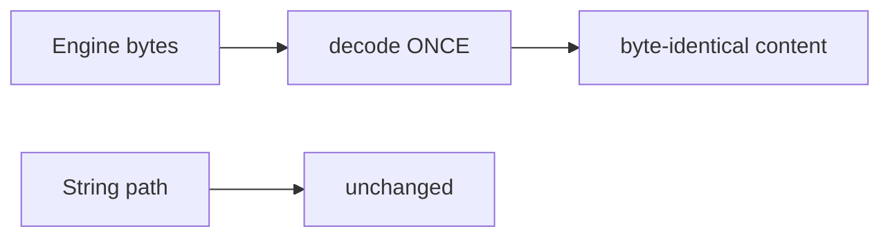

# Preview — Bridge Double-Encode Fix

## Approach

Bytes path: decode exactly once; large-content round-trip test proves byte-identical.

## Fix boundary
bridge.py bytes path (L214/238) + TDD round-trip test (≥102400 bytes).

## Acceptance mapping
AC-BD-001..003, EC-BD-001..004.
