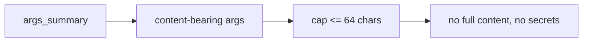

# Preview — Bridge Log Hygiene

## Approach

Bound content-bearing arg summaries at ≤64 chars; unit-test cap and no-leak; keep summaries useful.

## Fix boundary
`_truncated_args_summary` (bridge.py) + TDD cap tests.

## Acceptance mapping
AC-BH-001..003, EC-BH-001..004.
