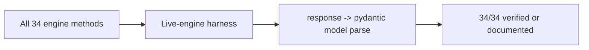

# Preview — Camelization Live-Coverage Tests

## Approach

Systematic live-engine coverage of every bridge method; shape-locked mock tests for untestable ones with documented reasons.

## Fix boundary
New live coverage tests (tests/core/) + documentation of exceptions.

## Acceptance mapping
AC-CM-001..003, EC-CM-001..004.
