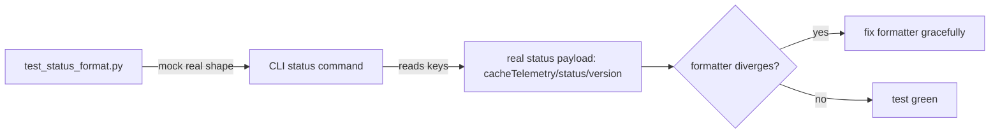

# DESIGN PREVIEW — CLI Status Test Alignment

## Approach

- The real engine status shape is the contract; the test mock and the CLI formatter must both
  conform to it.
- TDD: failing test first with the real shape, then fix formatter if needed.
