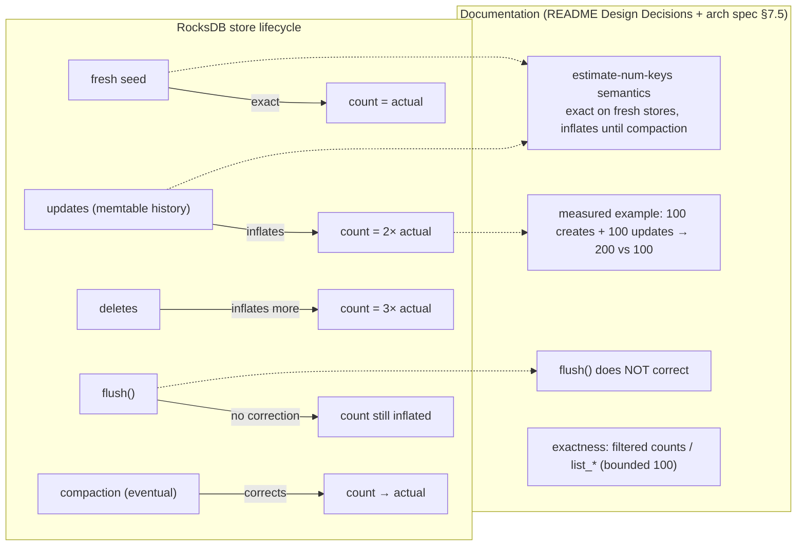

# Design Preview — Count Endpoints: Document Estimate Semantics

> Auto Bug Loop Iteration 3 · Contract: `2026-08-01-count-estimate-docs` · Finding: PF-11 (LOW)

## 1 · Semantics to Document

## 2 · Acceptance Gates

| Check | Assertion |
|---|---|
| AC-ED-001 | README Design Decisions documents the caveat |
| AC-ED-002 | architecture spec §7.5 consistent caveat |
| AC-ED-003 | concrete measured numbers included |
| AC-ED-004 | docs-only change; suite green (881) |
