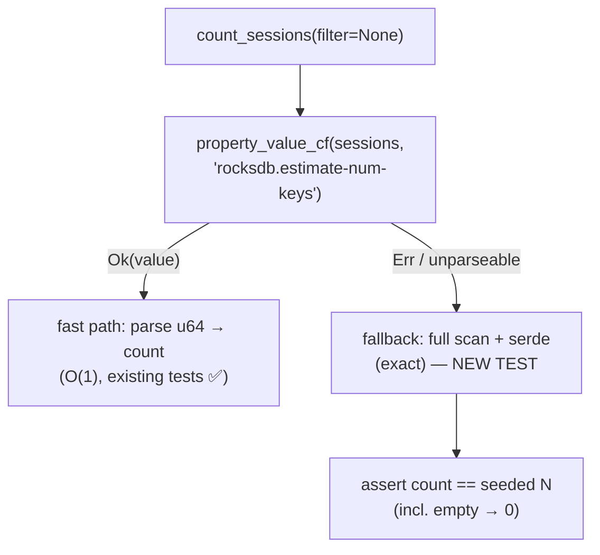

# Design Preview — count_sessions Fallback Test

> Auto Bug Loop Iteration 3 · Contract: `2026-08-01-count-fallback-test` · Finding: Design F-1 (LOW)

## 1 · Fallback Branch Under Test

## 2 · Test Design

- Test-local forcing of the property-unavailable branch (unit-level; no production flags).
- Assert exact unfiltered totals on seeded and empty stores.
- Keep the existing fast-path tests green and independent.

## 3 · Acceptance Gates

| Check | Assertion |
|---|---|
| AC-CFT-001 | fallback test exists, runs, passes |
| AC-CFT-002 | exact count via fallback on seeded store |
| AC-CFT-003 | fast-path tests unaffected |
| AC-CFT-004 | cargo 469+ green; Python suite 881 green |
