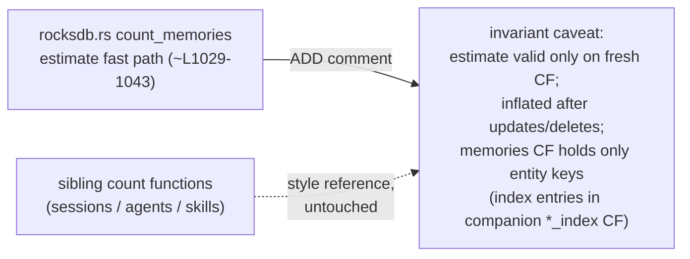

# Design Preview — count_memories Estimate Invariant Comment

> Auto Bug Loop Iteration 6 · Contract: `2026-08-01-count-memories-invariant-comment` · Finding: Code Reviewer [LOW]

## 1 · Change Surface

## 2 · Acceptance Gates

| Check | Assertion |
|---|---|
| AC-IV-01 | caveat present in `count_memories` fast path, sibling-equivalent |
| AC-IV-02 | `cargo test` 471 / 0 failed, behavior unchanged |
| AC-IV-03 | diff confined to the comment block |