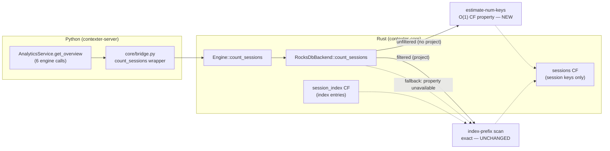
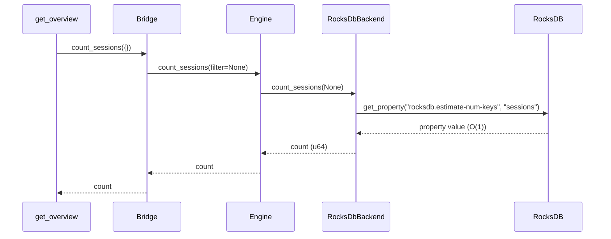

# Design Preview — Unfiltered `count_sessions` O(1) Fast Path

> Auto Bug Loop Iteration 3 · Bug contract: `2026-08-01-count-sessions-fast-path` · Finding: PF-10 (LOW)

## 1 · Architecture (as-is → to-be)

## 2 · Sequence (unfiltered count — new fast path)

## 3 · Behavior Contract

| Case | Filter | Path | Result |
|---|---|---|---|
| Unfiltered, property available | `{}` / `None` | estimate-num-keys O(1) | exact count on seeded stores (estimate semantics documented) |
| Unfiltered, property unavailable | `{}` / `None` | full scan fallback | exact count (unchanged behavior) |
| Filtered | `{"project": "X"}` | index-prefix scan | exact count (unchanged) |

## 4 · Verification Plan

1. Rust tests: unfiltered parity, empty → 0, filtered exactness, fallback (mirror `agent_skill_test.rs:148-262` pattern).
2. Rebuild wheel (`maturin build --release` + `pip3 install --user --break-system-packages --force-reinstall`).
3. Python tests: analytics overview counts, bridge live coverage against rebuilt wheel.
4. Full suite green (baseline 867 + new tests, 0 failures).
