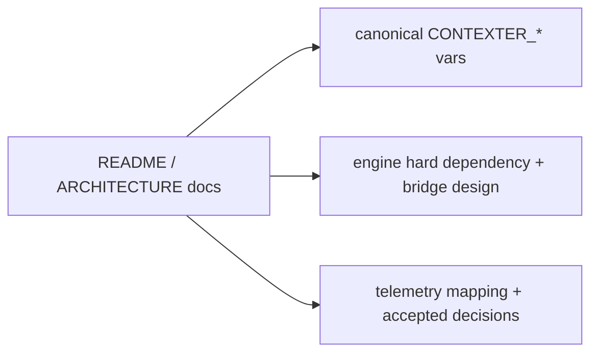

# Preview — Documentation Notes

## Approach

Update docs to reflect canonical env vars, engine dependency, bridge design decisions, and resolved findings.

## Fix boundary
Documentation files only.

## Acceptance mapping
AC-DN-001..003, EC-DN-001..002.
