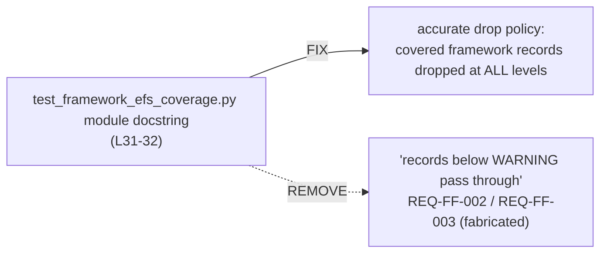

# Design Preview — EFS Test Docstring Accuracy

> Auto Bug Loop Iteration 5 · Contract: `2026-08-01-efs-docstring-truth` · Finding: Code Reviewer [LOW] (docstring)

## 1 · Change Surface

## 2 · Acceptance Gates

| Check | Assertion |
|---|---|
| AC-DC-001 | docstring: covered records dropped at all levels (incl. below-WARNING) |
| AC-DC-002 | only `REQ-FC-*` / `REQ-FL-*` cited — no fabricated IDs |
| AC-DC-003 | suite 904+ / 0 failed / 0 warnings — behavior unchanged |
| AC-DC-004 | diff confined to the docstring |