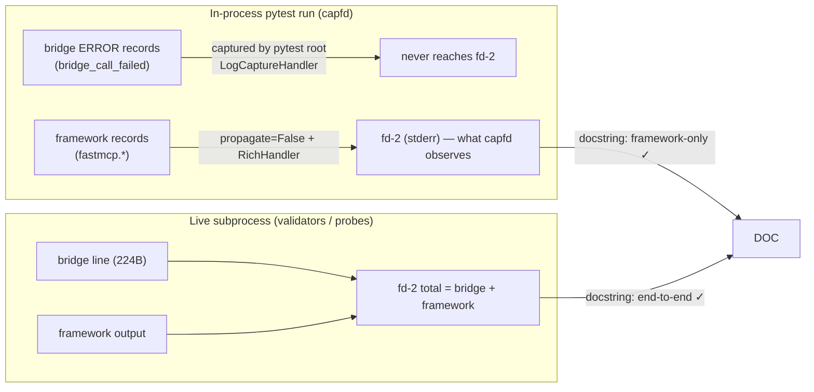

# Design Preview — EFS Test Module Precision

> Auto Bug Loop Iteration 3 · Contract: `2026-08-01-efs-test-precision` · Findings: Code F-3/F-4, UT LOW evidence mismatch

## 1 · Observation Model Correction

**Correction:** docstring must state in-process capfd = framework-only; live end-to-end covers bridge + framework.

## 2 · Evidence Consistency

- `failure_specific_bytes = len(failure_section)` where the section is isolated between baseline markers; clamp to ≥0; assert non-negative in tests.

## 3 · Acceptance Gates

| Check | Assertion |
|---|---|
| AC-EP-001 | redundant n×512 assertion gone |
| AC-EP-002 | docstring matches empirical observation model |
| AC-EP-003 | evidence bytes non-negative, consistent |
| AC-EP-004 | suite green (881+), 13 EFS tests discriminating |
