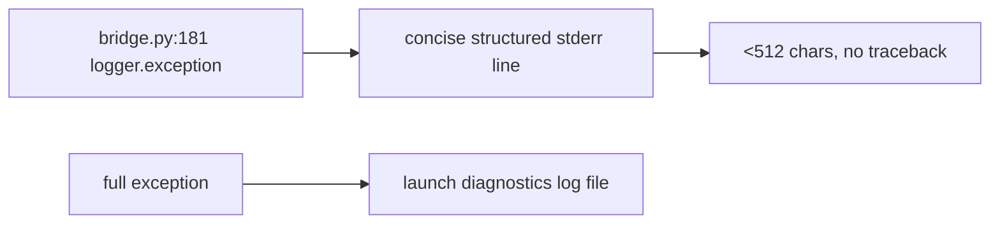

# DESIGN PREVIEW — Engine-Failure Stderr Hygiene

```mermaid
flowchart LR
    A[bridge.py:181 logger.exception] --> B[concise structured stderr line]
    B --> C[<512 chars, no traceback]
    D[full exception] --> E[launch diagnostics log file]
```
- Align runtime engine-failure diagnostics with launch-failure design: concise stderr, full
  detail to log file.
