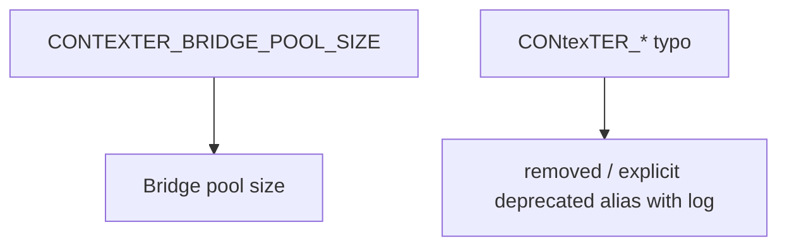

# Preview — Env Var Canonicalization

## Approach

Canonical `CONTEXTER_*` only. Typo variant removed; if alias kept: explicit, logged, tested.

## Fix boundary
bridge.py:112 + any `CONtexTER_` reads + TDD canonical-var test + grep audit.

## Acceptance mapping
AC-EV-001..003, EC-EV-001..004.
