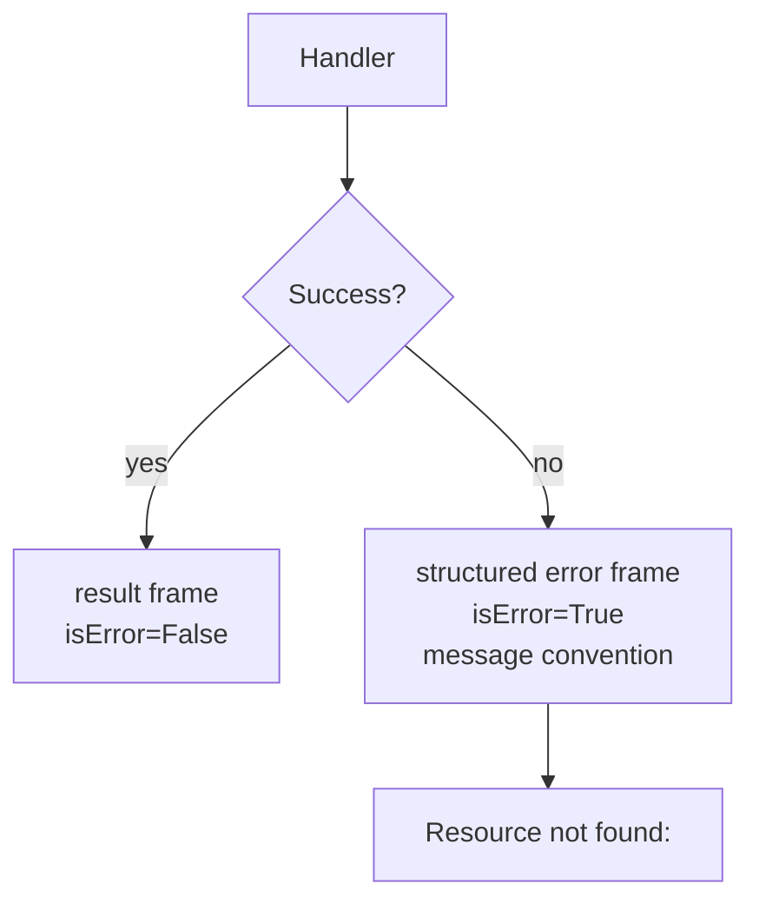

# Preview — Error-Shape Drift Repair

## Approach

Centralize error framing in a helper: not-found → `Resource not found: <id>`; validation → structured; engine failure → structured. Never return `{"error":...}` as success.

## Fix boundary
Handler error paths (get_session, get_memory, get_agent, etc.), shared error helper, + TDD tests.

## Acceptance mapping
AC-ES-001..005, EC-ES-001..006.
