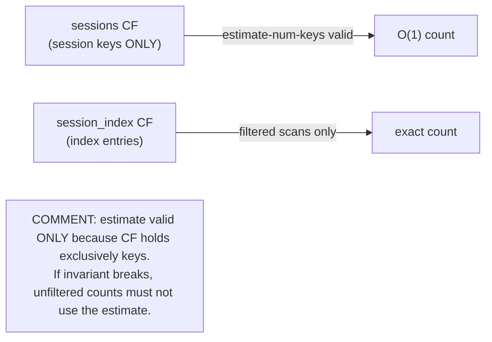

# Design Preview — Estimate Fast Path: Document CF Invariant

> Auto Bug Loop Iteration 3 · Contract: `2026-08-01-estimate-invariant-comment` · Finding: Code F-5 (INFO)

## 1 · Invariant to Document

## 2 · Acceptance Gates

| Check | Assertion |
|---|---|
| AC-EIC-001 | invariant comment at estimate paths (sessions + agents/skills if missing) |
| AC-EIC-002 | zero logic changes; suites green |
