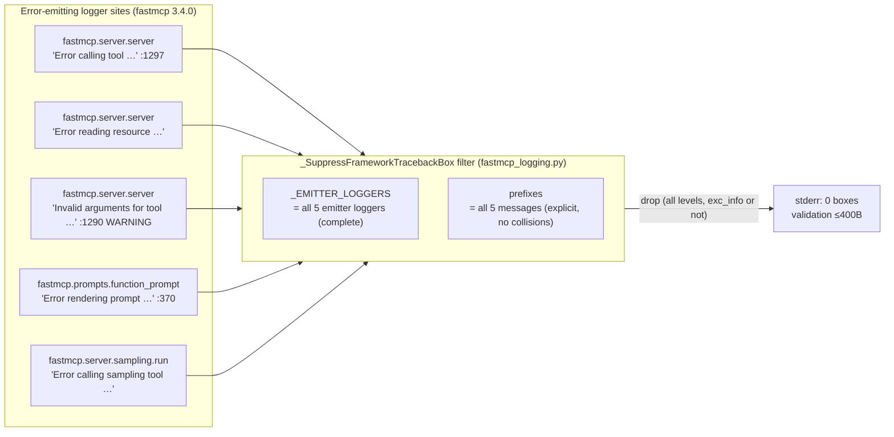
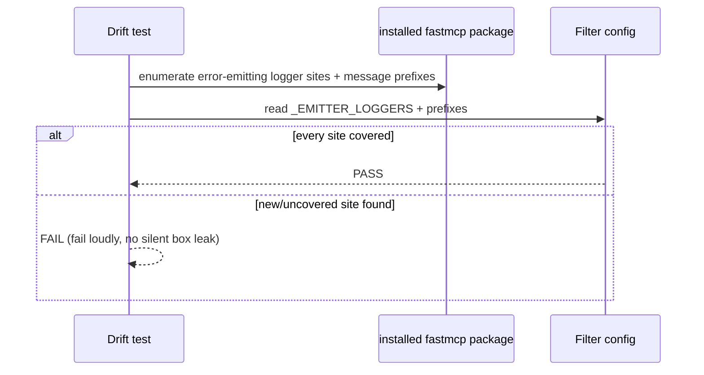

# Design Preview — FastMCP Filter Coverage: Complete Emitter/Prefix Coverage

> Auto Bug Loop Iteration 3 · Contract: `2026-08-01-fastmcp-filter-coverage` · Findings: Code F-1/F-6, Security F-IT3-01, UT MEDIUM

## 1 · Emitter Inventory (fastmcp 3.4.0 — installed framework)

**Gap today:** `P` and `M` uncovered; `W` prefix unmatched → validation-class stderr 486B (95% budget), 567B width-dependent.

## 2 · Drift Test (pins coverage)

## 3 · Acceptance Gates

| Check | Assertion |
|---|---|
| AC-FC-001 | all 5 emitters + prefixes covered (inventory-verified) |
| AC-FC-002 | validation failure stderr ≤400B, 0 box/traceback/file:line |
| AC-FC-003 | prompt/sampling/validation records dropped from true origin loggers |
| AC-FC-004 | contexter logs unaffected (bridge line still emitted) |
| AC-FC-005 | drift test green; fails on uncovered emitter |
| AC-FC-006 | drop-policy documented + asserted |
| AC-FC-007 | suite green (881 + new) |
