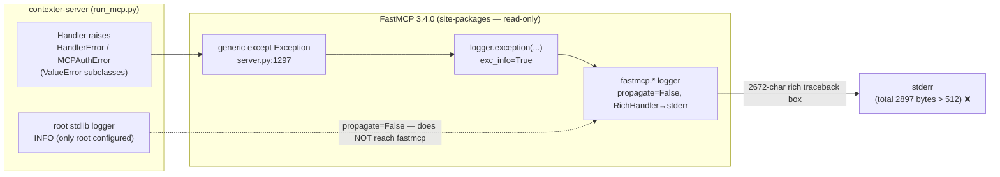
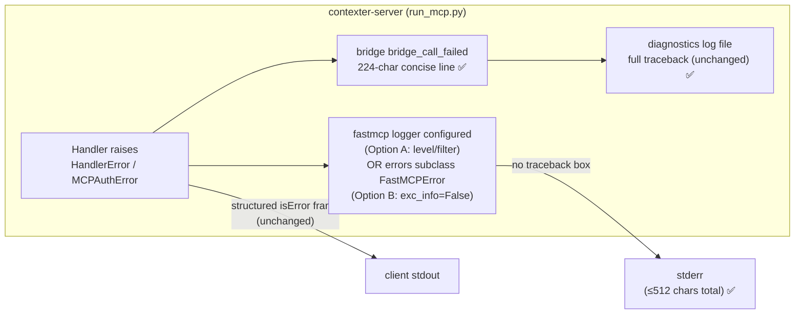
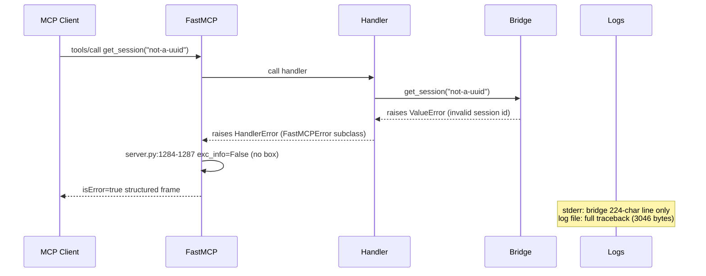

# Design Preview — FastMCP Framework Logging: Bounded Failure Stderr (End-to-End)

> Auto Bug Loop Iteration 3 · Bug contract: `2026-08-01-fastmcp-framework-logging` · Finding: AC-EFS-001 (LOW)

## 1 · Problem Diagram (as-is)

## 2 · Target (to-be)

## 3 · Sequence (engine failure, Option B shown)

## 4 · Acceptance Gates

| Check | Assertion |
|---|---|
| AC-FL-001 | engine failure total stderr ≤512 chars, no `╭` box |
| AC-FL-002 | 0 framework boxes across the 9 error classes |
| AC-FL-003 | diagnostics log still holds full traceback |
| AC-FL-004 | client-visible messages byte-identical |
| AC-FL-005 | success path + stdout purity + suite (867+) green |
| AC-FL-006 | launch failure rc=2, one clean line (unchanged) |
