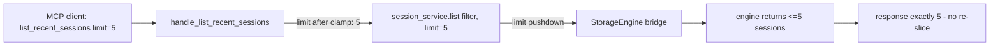

# DESIGN PREVIEW — Handler Limit Passthrough

## Approach

- Clamping lives in the handler (mirrors service rule): negative/zero → 0, huge → 10_000, None → leave None (service default 100).
- The service and engine already honor the limit; this contract only wires the handler.
- Tests: handler-level spy asserting the limit argument passed to the service; no re-slice assertion.
