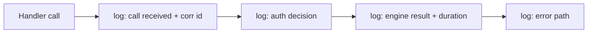

# Preview — Handler Observability Logs

## Approach

Structured handler logs with correlation id; no content/secrets (B9 bounds apply).

## Fix boundary
Handlers + logging helper + caplog tests.

## Acceptance mapping
AC-HO-001..003, EC-HO-001..004.
