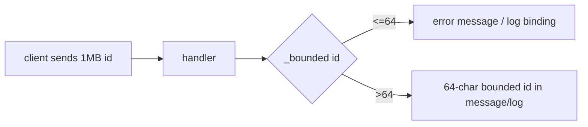

# DESIGN PREVIEW — Handler ID Bounding

```mermaid
flowchart LR
    A[client sends 1MB id] --> B[handler]
    B --> C{_bounded id}
    C -->|<=64| D[error message / log binding]
    C -->|>64| E[64-char bounded id in message/log]
```
- Apply existing `_bounded()` (64-char cap) at all error-message and log-binding sites.
- No signature or message-format changes for valid ids.
