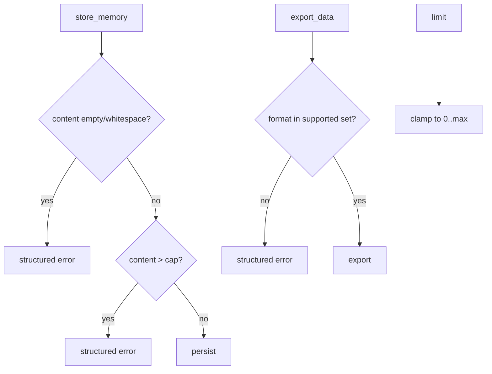

# Preview — Input Validation Gaps Repair

## Approach

Central validation helpers: non-empty content, size caps (content/query), export format allowlist, limit clamping. Errors never echo unbounded input.

## Fix boundary
Handlers store_memory/export_data/list_recent_sessions/search_memories + shared validators + TDD tests.

## Acceptance mapping
AC-IV-001..005, EC-IV-001..009.
