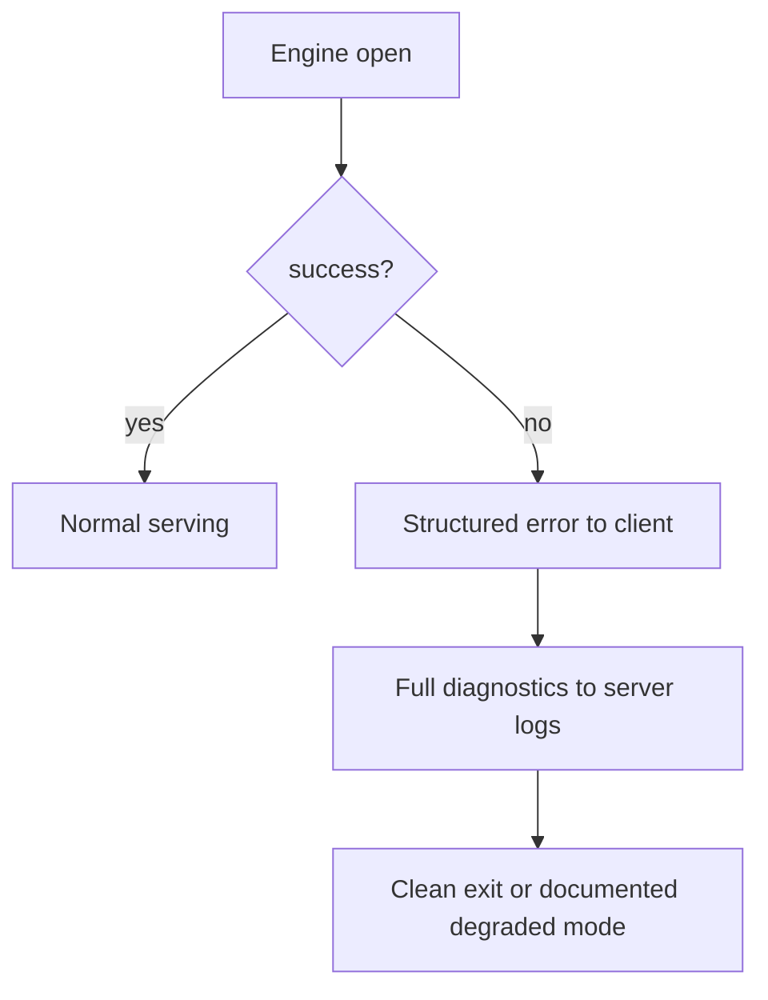

# Preview — Launch Error Handling

## Approach

Clean, structured client error on engine-open failure; raw detail only in logs; defined process behavior.

## Fix boundary
Launcher path (engine open error handler) + TDD launch-failure test (locked/unwritable dir).

## Acceptance mapping
AC-LH-001..003, EC-LH-001..004.
