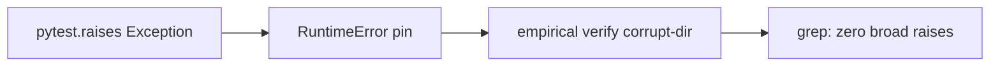

# DESIGN PREVIEW — Launcher Exception Type Pin

```mermaid
flowchart LR
    A[pytest.raises Exception] --> B[RuntimeError pin]
    B --> C[empirical verify corrupt-dir]
    C --> D[grep: zero broad raises]
```
- Test-only change; no production code touched.
