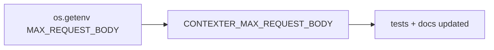

# DESIGN PREVIEW — MAX_REQUEST_BODY Env Canonicalization

```mermaid
flowchart LR
    A[os.getenv MAX_REQUEST_BODY] --> B[CONTEXTER_MAX_REQUEST_BODY]
    B --> C[tests + docs updated]
```
- One-line canonicalization + test/docs updates.
