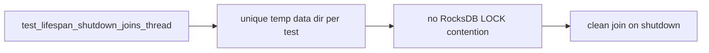

# Preview — Pre-Existing Lifespan Test Fix

## Approach

Isolate engine data dirs in tests; preserve original shutdown-join intent; suite fully green.

## Fix boundary
Lifespan test file (test infra only).

## Acceptance mapping
AC-LS-001..003, EC-LS-001..003.
