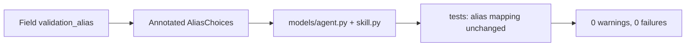

# DESIGN PREVIEW — Pydantic Alias Annotated

```mermaid
flowchart LR
    A[Field validation_alias] --> B[Annotated AliasChoices]
    B --> C[models/agent.py + skill.py]
    C --> D[tests: alias mapping unchanged]
    D --> E[0 warnings, 0 failures]
```
- Pure typing-level change; runtime behavior preserved.
