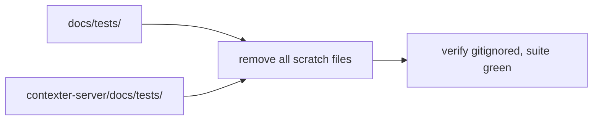

# Preview — Scratch File Cleanup

## Approach

Delete leftover scratch files in both `docs/tests/` dirs; confirm nothing references them; suite green.

## Fix boundary
Filesystem cleanup only (Worker executes), no production code.

## Acceptance mapping
AC-SC-001..003, EC-SC-001..002.
