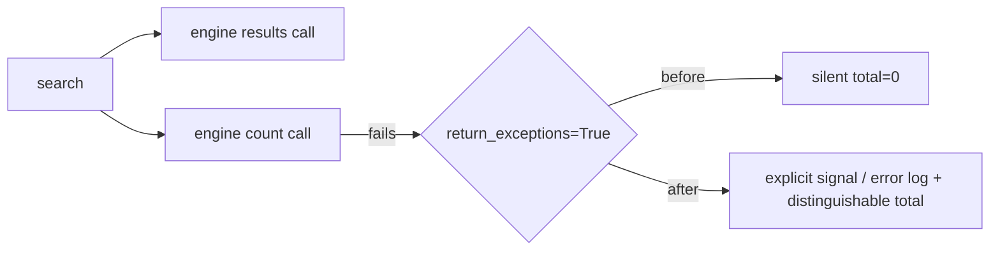

# DESIGN PREVIEW — Search Total Failure Silencing

```mermaid
flowchart LR
    A[search] --> B[engine results call]
    A --> C[engine count call]
    C -->|fails| D{return_exceptions=True}
    D -->|before| E[silent total=0]
    D -->|after| F[explicit signal / error log + distinguishable total]
```
- Remove silent masking; choose explicit surfaced behavior.
