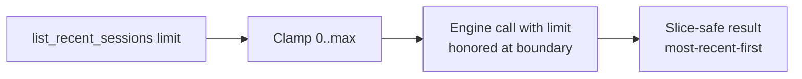

# Preview — Session Limit Pushdown

## Approach

Push limit into the engine call; keep ordering; clamp edges; spy test proves engine receives the limit.

## Fix boundary
`services/session_service.py` (or handler) + TDD spy test.

## Acceptance mapping
AC-SL-001..003, EC-SL-001..005.
