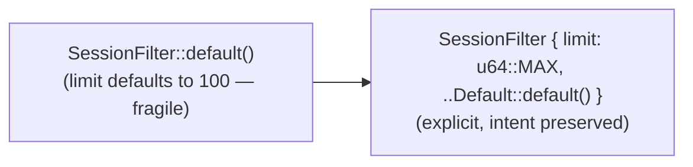

# Design Preview — Session Concurrent Test: Pin Explicit Limit

> Auto Bug Loop Iteration 3 · Contract: `2026-08-01-session-test-limit-pin` · Finding: Code F-2 (NIT)

## 1 · Change

## 2 · Acceptance Gates

| Check | Assertion |
|---|---|
| AC-SL-001 | explicit limit set |
| AC-SL-002 | 100 concurrent writes still asserted |
| AC-SL-003 | cargo + Python suites green |
