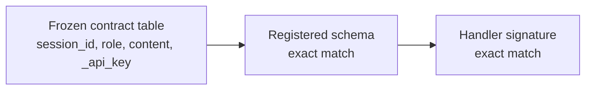

# Preview — store_memory Schema Conformity

## Approach

Align registered schema + handler signature to the frozen contract table; lock with a schema-registration test.

## Fix boundary
store_memory handler registration/signature + TDD schema test.

## Acceptance mapping
AC-SM-001..003, EC-SM-001..003.
