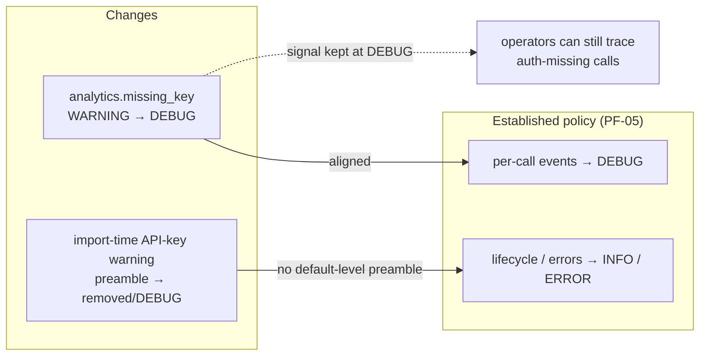

# Design Preview — Success-Path / Launch Log Hygiene

> Auto Bug Loop Iteration 3 · Contract: `2026-08-01-success-path-log-hygiene` · Findings: UT LOW (missing_key WARNINGs), UT INFO (launch preamble)

## 1 · Log-Level Policy Alignment

## 2 · Acceptance Gates

| Check | Assertion |
|---|---|
| AC-SH-001 | success-path stderr: INFO only, ZERO WARNINGs |
| AC-SH-002 | missing_key visible at DEBUG |
| AC-SH-003 | launch stderr clean (no preamble; rc=2 failure line only) |
| AC-SH-004 | auth enforcement unchanged |
| AC-SH-005 | suite green (881+) |
