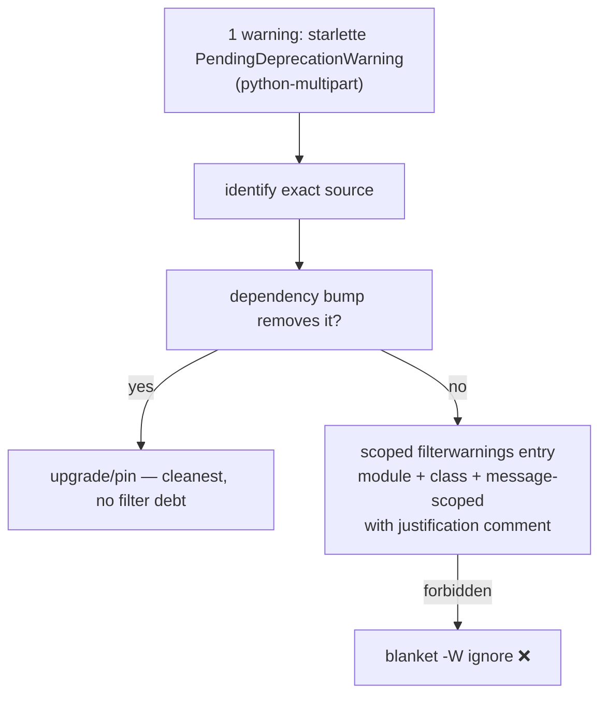

# Design Preview — Suite Warning Hygiene

> Auto Bug Loop Iteration 3 · Contract: `2026-08-01-suite-warning-hygiene` · Finding: SPEC INFO (starlette PendingDeprecationWarning)

## 1 · Decision Path

## 2 · Acceptance Gates

| Check | Assertion |
|---|---|
| AC-SW-001 | suite: 0 warnings, 881+ passed |
| AC-SW-002 | filter (if used) scoped + justified |
| AC-SW-003 | other warnings still surface |
| AC-SW-004 | suite green, test content unchanged |
