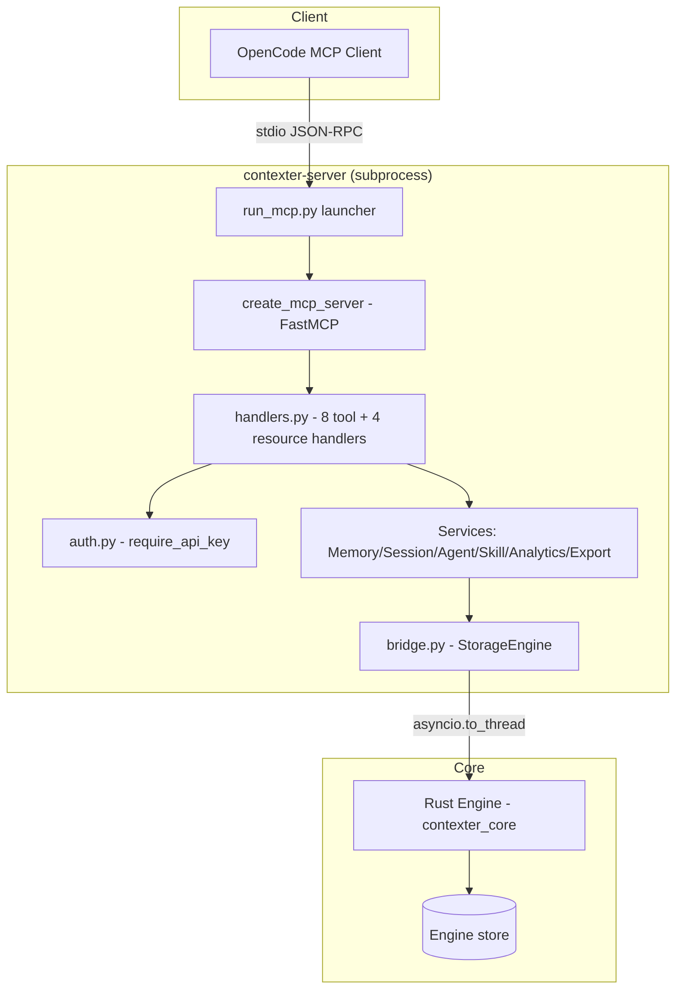

# MCP Server Live-Functionality Repair — Approved Contract

> **Status:** `APPROVED — Contract Frozen` | **Version:** `v1.0.0`
> **Feature:** 11 Acceptance Criteria · 19 Edge Cases

---

## Navigation

- [System Design](#architecture)
- [Data Flow](#dataflow)
- [Context](#context)
- [Decision](#decision)
- [API](#api)
- [AC](#ac)
- [Edge Cases](#edgecases)
- [Tests](#tests)
- [References](#references)
- [Contract](#contract)
- [Summary](#summary)

---

## Quick Stats

| Metric | Value |
|---|---|
| AC Passed | 11 |
| Edge Cases | 19 |
| Artifacts | 4 |
| Investigation Tracks | 3 |

---

## System Design {#architecture}

> **Status:** `FINAL`

Frozen architecture for the MCP repair. The design is a **repair**, not a redesign: the existing adapter layering is correct and preserved.

### Architecture



### Frozen Components

| Component | File | Contract |
|---|---|---|
| Launcher | `run_mcp.py` | Real services wired to engine; stdio transport; clean stderr messages only |
| MCP server | `mcp_server.py` | Registers 8 tools + 4 resources; schemas SHALL match handler signatures exactly |
| Handlers | `mcp_tools/handlers.py` | Return real data; accept every schema-declared parameter; structured errors |
| Auth | `mcp_tools/auth.py` | Unchanged — `require_api_key()`, `_api_key` kw-only pattern (BUG-019/028/029) |
| Bridge | `bridge.py` | `_SYNC_ENGINE_CLASS` validation; no MagicMock in dispatch; bytes path ≥102400 |
| Services | `services/*.py` | Domain layer — modified only if investigation proves a defect |

> ✅ No `unittest.mock` object appears anywhere in the live call path (REQ-001, AC-009).

---

## Data Flow Sequence {#dataflow}

Target runtime behavior for every tool call over live stdio.

### 1. Client connects and lists tools

OpenCode launches `run_mcp.py` as a subprocess; MCP `initialize` + `tools/list` return schemas aligned to handler signatures.

### 2. Client invokes a tool

`tools/call` with schema-validated arguments reaches the handler without `TypeError` (`unexpected keyword argument` class of failure eliminated).

### 3. Handler validates auth

`_api_key` validated via `require_api_key()` when `CONTEXTER_API_KEY` is set; open mode when unset.

### 4. Handler delegates to the real service

Every handler calls its real service instance (MemoryService, SessionService, AgentService, SkillService, AnalyticsService, ExportService) — never a mock.

### 5. Service → Bridge → Engine

Service performs the domain operation through `StorageEngine`; bridge dispatches the sync Rust `Engine` call via `asyncio.to_thread` with method-existence validation against `_SYNC_ENGINE_CLASS`.

### 6. Real result returned

Engine data marshals back as a JSON-RPC result. Errors (not found, invalid params, engine failure) return structured `isError` results — process survives, stdout stays clean.

---

## Why This Feature Exists {#context}

| The Pain | The Principle |
|---|---|
| The MCP server connects and exposes 8 tools + 4 resources, but every live call fails — `MagicMock can't be used in 'await' expression` or `unexpected keyword argument 'type'`. The test suite is green because it calls handlers directly; the real client path is broken. Agents trained to ignore a dead tool. | "Connected is not functional." A tool that errors on every invocation is worse than no tool. The MCP layer must be proven against a live protocol client, with every repaired failure mode regression-locked by a test that fails on the old code. |

---

## Final Decision — Chosen Path {#decision}

> **Status:** `APPROVED`

### Repair-in-place with evidence-first investigation

Three parallel investigation tracks (MagicMock origin, schema/handler drift, live stdio probe) produce evidence **before** any fix. The fix then follows TDD: reproducing tests first, minimal changes to registration/signatures/wiring, no redesign, no auth changes, full suite green.

### Resolved Questions

| ID | Question | Resolution |
|---|---|---|
| RQ-001 | Scope of "functional"? | All 8 tools + 4 resources return real engine data over live stdio (user-confirmed) |
| RQ-002 | Verify end-to-end? | Yes — live reconnect and re-probe of every tool/resource through the real MCP protocol (user-confirmed) |
| RQ-003 | Auth model? | Preserved unchanged — `_api_key` optional, `require_api_key()` enforcement (user-confirmed) |
| RQ-004 | Root cause of MagicMock? | Open — T1 investigation; evidence required before fix |
| RQ-005 | Schema drift cause? | Open — T2 investigation (FastMCP version vs stale signatures) |
| RQ-006 | DDD override? | No — DDD applies; MCP layer stays a thin adapter |

---

## API Contract {#api}

> **Status:** `FROZEN`

### Tools (8) — schema SHALL match handler signature

| Tool | Parameters (schema) | Target behavior |
|---|---|---|
| `get_system_health` | `_api_key?` | Real health payload |
| `list_recent_sessions` | `project?`, `limit?`, `_api_key?` | Real session list |
| `get_session` | `id` (req), `_api_key?` | Real session record |
| `get_agent_info` | `id` (req), `_api_key?` | Real agent config |
| `list_skills` | `type?`, `_api_key?` | Filtered real skill list |
| `search_memories` | `query` (req), `type?`, `project?`, `limit?`, `_api_key?` | Filtered real memories |
| `store_memory` | `session_id` (req), `role` (req), `content` (req), `_api_key?` | Persisted memory, real result |
| `export_data` | `format?`, `entities?`, `_api_key?` | Real export payload |

### Resources (4)

| URI | Handler | Auth |
|---|---|---|
| `contexter://session/{id}` | `handle_session_resource` | `require_api_key()` |
| `contexter://memory/{id}` | `handle_memory_resource` | `require_api_key()` |
| `contexter://agent/{id}` | `handle_agent_resource` | `require_api_key()` |
| `contexter://analytics/overview` | `handle_analytics_overview_resource` | `require_api_key()` |

### Success shape (frozen)

```json
{
  "jsonrpc": "2.0",
  "id": 1,
  "result": { "content": [{ "type": "text", "text": "<real data>" }] }
}
```

### Error shape (frozen)

```json
{
  "jsonrpc": "2.0",
  "id": 1,
  "error": { "code": -32602, "message": "Missing required parameter: query" }
}
```

No stdout prints. No tracebacks. Process survives errors.

---

## Acceptance Criteria {#ac}

> **Status:** ✅ 11 / 11 Pending Validation

| ID | Description | Status |
|---|---|---|
| AC-001 | All 8 tools return real data over live stdio MCP client (no mock errors, no signature errors) | ✅ |
| AC-002 | All 4 resources resolve real records over live client | ✅ |
| AC-003 | `list_skills` / `search_memories` accept the `type` filter parameter | ✅ |
| AC-004 | Auth preserved: key unset → success; wrong `_api_key` → rejection | ✅ |
| AC-005 | Invalid parameters → structured MCP errors; no crash, no stdout tracebacks | ✅ |
| AC-006 | Full suite passes; new tests reproduce each repaired failure mode | ✅ |
| AC-007 | No MagicMock or unittest.mock object anywhere in live call path | ✅ |
| AC-008 | Engine failure contained; server process survives | ✅ |
| AC-009 | Empty engine → graceful empty results | ✅ |
| AC-010 | `store_memory` persists; `search_memories` returns it | ✅ |
| AC-011 | stdout carries only MCP JSON-RPC frames | ✅ |

---

## Edge Cases {#edgecases}

> **Status:** 19 Documented

| ID | Scenario | Expected Behavior | Priority |
|---|---|---|---|
| EC-001 | Nonexistent session/memory/agent ID | Structured error; process alive | Documented |
| EC-002 | `search_memories` without `query` | Structured validation error | Documented |
| EC-003 | Extra/unknown params | Tolerated or structured error — never TypeError traceback | Documented |
| EC-004 | Registered `type` param on skills/memories | Accepted and applied | Documented |
| EC-005 | Empty engine | Empty success results | Documented |
| EC-006 | Wrong/missing `_api_key` when key set | Auth rejection (BUG-019 behavior) | Documented |
| EC-007 | Key unset, no `_api_key` passed | Success (backward compat) | Documented |
| EC-008 | Engine path unopenable at launch | Clean stderr exit; no stdout pollution | Documented |
| EC-009 | Engine operation raises mid-call | Structured error; next call works | Documented |
| EC-010 | Large memory content (≥102400 B) | Bytes path; success | Documented |
| EC-011 | `limit` edge values (0, negative, huge) | Clamped/sane; success | Documented |
| EC-012 | Unsupported `export_data` format | Structured error | Documented |
| EC-013 | Concurrent tool calls | Both complete; frames intact | Documented |
| EC-014 | FastMCP missing at launch | Clear stderr exit (existing) | Documented |
| EC-015 | Wrong JSON-RPC payload | Protocol error; process alive | Documented |
| EC-016 | Bridge method mismatch | Structured error via class validation — never mock await | Documented |
| EC-017 | FastMCP version schema behavior | Explicit schema alignment/pin | Documented |
| EC-018 | Concurrent `store_memory` same session | Both persist | Documented |
| EC-019 | Client disconnect mid-call | Clean handling; no zombie | Documented |

---

## Test Coverage {#tests}

> **Status:** Planned — reproduction tests first (T4), then fix (T5), then live verification (T6)

| # | Test Class | Description |
|---|---|---|
| 1 | Handler unit tests (existing, extended) | Every tool returns real data through real services |
| 2 | Schema-registration tests | Registered schema params ⊆ handler params for all 8 tools |
| 3 | `type`-filter tests | `list_skills`/`search_memories` accept `type` (extends `test_handlers_type_filter.py`) |
| 4 | Live stdio protocol tests | Subprocess `run_mcp.py` + MCP client: all tools/resources real data |
| 5 | Auth regression tests | BUG-019/028/029 behavior preserved |
| 6 | Error-path tests | Invalid params, missing IDs → structured errors, process alive |
| 7 | No-mock inspection | No `unittest.mock` objects in the live call path |

---

## Implementation References {#references}

### Primary repair targets — Python / FastMCP

**`mcp_server.py`** — tool registration. Registered input schemas SHALL declare exactly the parameters each handler accepts (incl. `type` for `list_skills`/`search_memories`, `_api_key` on all tools).

**`mcp_tools/handlers.py`** — handler signatures aligned to schemas; real service calls only; structured error returns.

**`bridge.py`** (if mock origin confirmed) — dispatch validation against `_SYNC_ENGINE_CLASS`; no MagicMock leakage.

### Test patterns — pytest

- `tests/mcp/test_mcp_server.py` — server-level tests
- `tests/mcp/test_mcp_auth.py` — auth tests
- `tests/mcp/test_handlers_type_filter.py` — type filter tests (extend)
- New: live stdio E2E test using FastMCP client transport against `run_mcp.py` subprocess with a temp engine (`CONTEXTER_PATH`)

---

## Validation Contract Artifacts {#contract}

| File | Description |
|---|---|
| **SPEC.md** — `docs/contracts/2026-08-01-mcp-live-fix/SPEC.md` | Formal specification: REQ-001..007, CON-001..003, 4.1/4.2 interface contracts |
| **ACCEPTANCE.md** — `docs/contracts/2026-08-01-mcp-live-fix/ACCEPTANCE.md` | Given/When/Then acceptance criteria for all 11 verification points |
| **EDGE_CASES.md** — `docs/contracts/2026-08-01-mcp-live-fix/EDGE_CASES.md` | Catalog of 19 edge cases across input, auth, integration, concurrency |
| **plan/preview/** — `docs/contracts/2026-08-01-mcp-live-fix/plan/preview/` | Design artifacts: architecture, data flow, API contracts |

---

## Approved Contract Summary {#summary}

| Metric | Count |
|---|---|
| AC (All Pending Validation) | 11 |
| Edge Cases | 19 |
| Investigation Tracks | 3 |
| Artifacts | 4 |

This approved contract defines the MCP Server Live-Functionality Repair for the Contexter project: repair-in-place, evidence-first, TDD-locked, verified through a live stdio MCP client.

---

*Generated · 2026-08-01 · Contexter — MCP Live-Functionality Repair Approved Contract · v1.0.0*

<!-- LOCKED: Template finalized on 2026-08-01 -->
