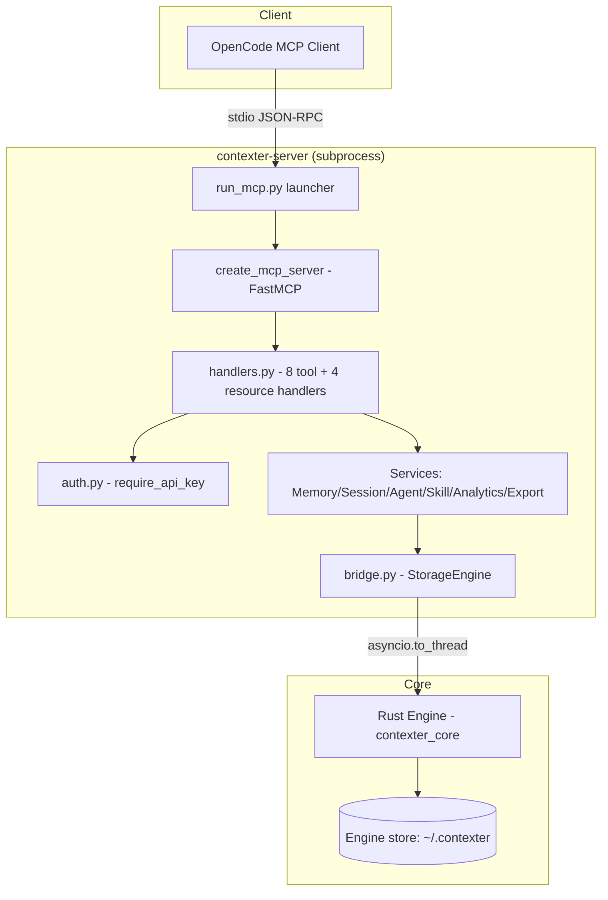
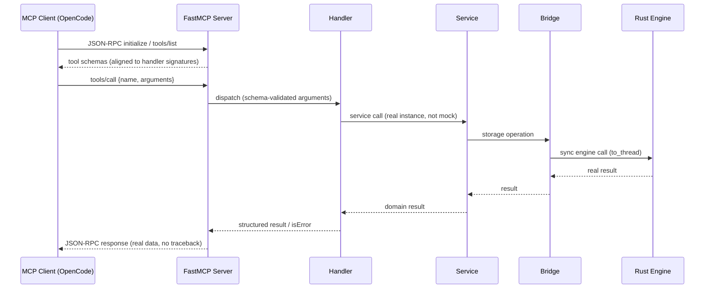

# MCP Server Live-Functionality Repair — Design Draft

> **Status:** `DRAFT — Pending Review` · **Version:** `v1.0-draft`
> **Feature:** Repair all 8 MCP tools + 4 resources to return real engine data over live stdio · 0 UI surface

---

## Navigation

- [Problem](#problem)
- [System Design](#architecture)
- [Data Flow](#dataflow)
- [Questions](#questions)
- [Decisions](#decisions)
- [API](#api)
- [Scope](#scope)
- [AC](#ac)
- [Edge Cases](#edgecases)
- [Summary](#summary)

---

## Why This Feature Exists {#problem}

| The Pain | The Principle |
|---|---|
| The MCP server is registered, connects, and exposes 8 tools + 4 resources — but **every live call fails**: either `MagicMock can't be used in 'await' expression` or `handle_list_skills() got an unexpected keyword argument 'type'`. The suite (≥579 tests) is green because unit tests call handlers directly; the real client path is broken. | **"Connected is not functional."** A tool that errors on every invocation is worse than no tool — it trains agents to ignore it. The MCP layer must be proven against a live protocol client, not just unit-tested in isolation. |

---

## System Design {#architecture}

> **Status:** `Draft` — architecture unchanged; the repair targets wiring, registration, and schema alignment.

### Architecture (As-Built, Target of Repair)



### Component Responsibilities

| Component | File | Role in the repair |
|---|---|---|
| Launcher | `run_mcp.py` | Real services wired to engine; stdio transport |
| MCP server | `mcp_server.py` | Registers 8 tools + 4 resources with schemas |
| Handlers | `mcp_tools/handlers.py` | **Repair target** — signatures must match schemas; must return real data |
| Auth | `mcp_tools/auth.py` | Preserved as-is (BUG-019/028/029) |
| Bridge | `bridge.py` | **Root-cause candidate** — mock origin; `_SYNC_ENGINE_CLASS` validation |
| Services | `services/*.py` | Domain layer — not to be modified unless investigation proves otherwise |

### Investigation Tracks (Phase 1 — parallel Workers)

| Track | Hypothesis to test | Evidence required |
|---|---|---|
| T1: MagicMock origin | Mocks enter via FastMCP registration wrapper, bridge dispatch, or test double leakage into wiring | Reproducer output showing where the MagicMock is awaited |
| T2: Schema drift | Registered schemas declare params (`type`, `_api_key`) the handlers do not accept | Full 8-tool schema-vs-signature comparison |
| T3: Live stdio probe | All 12 call sites (8 tools + 4 resources) fail live; capture raw frames | Pass/fail matrix with raw MCP responses |

---

## Data Flow {#dataflow}

### Live tool call (target behavior after repair)



### Numbered flow

1. Client connects via stdio and lists tools — schemas returned match handler signatures exactly.
2. Client calls a tool with valid arguments; FastMCP dispatches to the handler without `TypeError`.
3. Handler validates `_api_key` (preserved auth) and delegates to the real service instance.
4. Service performs the domain operation through the bridge.
5. Bridge dispatches the sync Rust `Engine` call via `asyncio.to_thread` — method existence validated against the real class, never a mock.
6. Engine returns real data; the result is marshalled back up and returned as a JSON-RPC result.
7. Errors (not found, invalid params, engine failure) become structured `isError` results — process survives.

---

## Open Questions {#questions}

| ID | Question | Status |
|---|---|---|
| OQ-001 | Root cause of `MagicMock` in the live path — registration wrapper, bridge dispatch, or leaked test double? | 🔶 Investigation |
| OQ-002 | Is the schema drift caused by FastMCP version behavior or stale handler signatures in `mcp_server.py`? | 🔶 Investigation |
| OQ-003 | Should `_SYNC_ENGINE_CLASS`-style validation be extended to the MCP layer to prevent mock leakage permanently? | 🔶 Decision after T1 |
| OQ-004 | Pin FastMCP version in `pyproject.toml` if version-dependent? | 🔶 Decision after T2 |

---

## Decision Log {#decisions}

| Date | ID | Description | Rationale |
|---|---|---|---|
| 2026-08-01 | CON-001 | MCP layer remains a thin adapter; domain logic stays in services | DDD bounded context; services already encapsulate rules |
| 2026-08-01 | CON-002 | Fix via TDD — reproducing tests first | Every repaired failure mode must be regression-locked |
| 2026-08-01 | CON-003 | Auth model (`_api_key`, `require_api_key`) preserved unchanged | Already hardened and reviewed (BUG-019/028/029) |
| 2026-08-01 | CON-004 | Live verification against a temp engine path | Avoids mutating user data; deterministic assertions |
| 2026-08-01 | CON-005 | Root cause open — evidence before hypothesis-driven fix | Guessing risks a wasted loop; Workers prove each track |

---

## API Contract {#api}

> ⚠️ **Needs review:** tool schemas must align with handler signatures; error shape must be structured.

### Tools (8)

| Tool | Parameters (schema) | Current live behavior | Target behavior |
|---|---|---|---|
| `get_system_health` | `_api_key?` | MagicMock await error | Real health payload |
| `list_recent_sessions` | `project?`, `limit?`, `_api_key?` | MagicMock await error | Real session list |
| `get_session` | `id` (req), `_api_key?` | MagicMock await error | Real session record |
| `get_agent_info` | `id` (req), `_api_key?` | MagicMock await error | Real agent config |
| `list_skills` | `type?`, `_api_key?` | `unexpected keyword argument 'type'` | Filtered real skill list |
| `search_memories` | `query` (req), `type?`, `project?`, `limit?`, `_api_key?` | `unexpected keyword argument 'type'` | Filtered real memories |
| `store_memory` | `session_id` (req), `role` (req), `content` (req), `_api_key?` | MagicMock await error | Persisted memory, real result |
| `export_data` | `format?`, `entities?`, `_api_key?` | MagicMock await error | Real export payload |

### Resources (4)

| URI | Handler | Auth |
|---|---|---|
| `contexter://session/{id}` | `handle_session_resource` | `require_api_key()` |
| `contexter://memory/{id}` | `handle_memory_resource` | `require_api_key()` |
| `contexter://agent/{id}` | `handle_agent_resource` | `require_api_key()` |
| `contexter://analytics/overview` | `handle_analytics_overview_resource` | `require_api_key()` |

### Success shape (target)

```json
{
  "jsonrpc": "2.0",
  "id": 1,
  "result": { "content": [{ "type": "text", "text": "<real data>" }] }
}
```

### Error shape (target)

```json
{
  "jsonrpc": "2.0",
  "id": 1,
  "error": { "code": -32602, "message": "Missing required parameter: query" }
}
```

No stdout prints. No tracebacks. Process survives errors.

---

## Out of Scope {#scope}

| # | Item | Rationale |
|---|---|---|
| 01 | REST API changes | API layer previously validated; failure is MCP-specific |
| 02 | CLI changes | CLI works per existing suite |
| 03 | Rust core changes | Bridge validation already prevents dispatch drift; only touch if investigation proves a core defect |
| 04 | Web UI | Frontend untouched |
| 05 | Auth model redesign | BUG-019/028/029 preserved |
| 06 | New MCP features/tools | Repair only |

---

## Acceptance Criteria {#ac}

> **Status:** 11 Pending

| ID | Description | Status |
|---|---|---|
| AC-001 | Live client calls all 8 tools → real data, no mock/signature errors | 🔶 Pending |
| AC-002 | Live client reads all 4 resources → real records | 🔶 Pending |
| AC-003 | `list_skills` / `search_memories` accept `type` parameter | 🔶 Pending |
| AC-004 | Auth: key unset → success; wrong key → rejection | 🔶 Pending |
| AC-005 | Invalid parameters → structured MCP errors, no crash/traceback | 🔶 Pending |
| AC-006 | Full suite passes; new tests cover each repaired failure mode | 🔶 Pending |
| AC-007 | No MagicMock anywhere in live call path | 🔶 Pending |
| AC-008 | Engine failure contained; process survives | 🔶 Pending |
| AC-009 | Empty engine → graceful empty results | 🔶 Pending |
| AC-010 | `store_memory` persists; search returns it | 🔶 Pending |
| AC-011 | stdout carries only MCP frames | 🔶 Pending |

---

## Edge Cases {#edgecases}

> **Status:** 19 Identified

| ID | Scenario | Expected Behavior | Priority |
|---|---|---|---|
| EC-001 | Nonexistent session/memory/agent ID | Structured error; process alive | P1 |
| EC-002 | `search_memories` without `query` | Structured validation error | P1 |
| EC-003 | Extra/unknown params | Tolerated or structured error — never TypeError traceback | P1 |
| EC-004 | Registered `type` param on skills/memories | Accepted and applied | P1 |
| EC-005 | Empty engine | Empty success results | P1 |
| EC-006 | Wrong/missing `_api_key` when key set | Auth rejection (BUG-019 behavior) | P1 |
| EC-007 | Key unset, no `_api_key` passed | Success (backward compat) | P1 |
| EC-008 | Engine path unopenable at launch | Clean stderr exit; no stdout pollution | P1 |
| EC-009 | Engine operation raises mid-call | Structured error; next call works | P1 |
| EC-010 | Large memory content (≥102400 B) | Bytes path; success | P2 |
| EC-011 | `limit` edge values (0, negative, huge) | Clamped/sane; success | P3 |
| EC-012 | Unsupported `export_data` format | Structured error | P2 |
| EC-013 | Concurrent tool calls | Both complete; frames intact | P2 |
| EC-014 | FastMCP missing at launch | Clear stderr exit (existing) | P2 |
| EC-015 | Wrong JSON-RPC payload | Protocol error; process alive | P2 |
| EC-016 | Bridge method mismatch | Structured error via class validation — never mock await | P1 |
| EC-017 | FastMCP version schema behavior | Explicit schema alignment/pin | P1 |
| EC-018 | Concurrent `store_memory` same session | Both persist | P3 |
| EC-019 | Client disconnect mid-call | Clean handling; no zombie | P3 |

---

## Design Draft Summary {#summary}

| Metric | Count |
|---|---|
| Acceptance Criteria | 11 |
| Edge Cases | 19 |
| Investigation Tracks | 3 |
| Open Questions | 4 |
| Decision Log Entries | 5 |

This draft covers the MCP Server Live-Functionality Repair for the Contexter project. The architecture is unchanged — the repair targets handler signatures, tool registration/schema alignment, and elimination of mock objects from the live call path, verified end-to-end over real stdio MCP.

---

**Generated · 2026-08-01 · Contexter — MCP Live-Functionality Repair Design Draft · v1.0-draft**

<!-- LOCKED: Template finalized on 2026-08-01 -->
