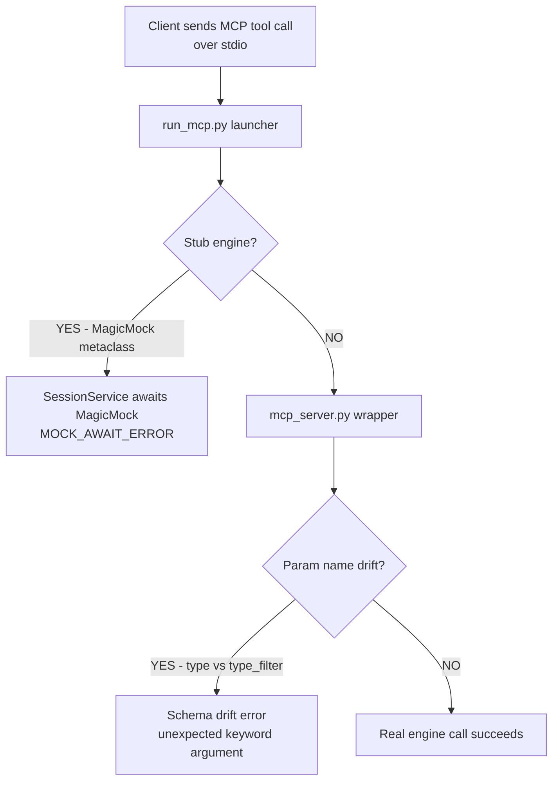
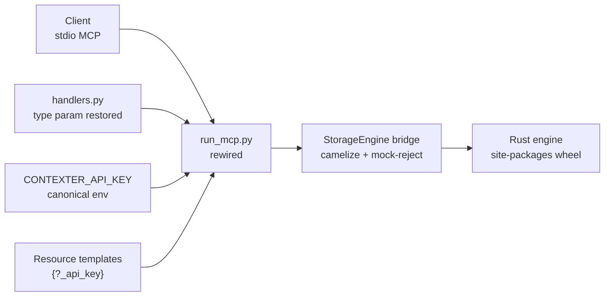

# Implementation Review — MCP Live-Functionality Repair

**Contract:** `docs/contracts/2026-08-01-mcp-live-fix/`
**Branch:** `feature/mcp-live-fix`
**Date:** 2026-08-01
**Workers:** T1–T3 (investigation, parallel) · Fix A (engine path) · Fix B (schema drift) · T6 (live verification)
**Status:** Implementation complete — **live MCP functional** (previously 0/12 → 9/12 matrix + auth matrix clean). Findings documented for Auto Bug Loop.

---

## 1. The Problem (Before)

Every live MCP call to the Contexter server failed. Two distinct root causes were proven by investigation:

- **MOCK_AWAIT_ERROR (10/12):** `contexter_core.py` was a committed Python stub — an `EngineMeta` metaclass injected class-attribute `MagicMock`s for all 34 engine methods. `run_mcp.py` wired this stub into services (`session_service.py:23`, `memory_service.py:44`), so any await exploded with `object MagicMock can't be used in 'await' expression` / `An asyncio.Future, a coroutine or an awaitable is required`.
- **SCHEMA_DRIFT_ERROR (2/12):** handlers renamed `type` → `type_filter` (handlers.py L68/L82/L159/L171) but `mcp_server.py` wrappers still forwarded `type=type` (L119/L171) → `handle_list_skills() got an unexpected keyword argument 'type'`.
- T3 live probe baseline: **0/12 passed**, 10 MOCK_AWAIT_ERROR, 2 SCHEMA_DRIFT_ERROR; `docs/tests/` not gitignored; env var mismatch (`CONtexTER_API_KEY` vs `CONTEXTER_API_KEY`).

---

## 2. The Fix (After)

### Fix A — Engine path (real engine + wiring)

| Change | Detail |
|---|---|
| Stub deleted | `contexter-server/src/contexter_core.py` removed (committed Python stub with MagicMock metaclass) |
| Real engine installed | Rust extension installed as wheel → `import contexter_core` → `Engine: <class 'builtins.Engine'>` |
| Launcher rewired | `run_mcp.py` now constructs engine via `StorageEngine` bridge (mirrors `main.py` pattern) instead of stub |
| Bridge hardened | `core/bridge.py` +87 lines: camelCase translation + explicit rejection of `unittest.mock` attribute types (`_SYNC_ENGINE_CLASS` guard, `json.loads` boundary) |
| Memory service | `services/memory_service.py` translation layer for engine camelCase responses |
| TDD | RED phase: 12 failures with stub → GREEN: 14/14 new tests; suite 647 passed / 1 pre-existing failure |

### Fix B — Schema drift + hygiene

| Change | Detail |
|---|---|
| Handler params restored | `mcp_tools/handlers.py`: `search_memories` L68/L82, `list_skills` L159/L171 back to `type` (contract frozen: `type`, not `type_filter`) |
| Tests updated | `test_handlers_type_filter.py`, `test_mcp_server.py`, `test_mcp_auth.py` (18/75/12 lines) — `type_filter=` → `type=` |
| Env var canonicalized | `CONTEXTER_API_KEY` everywhere (auth.py L45, mcp_server.py L68/L73, api/deps.py L51, main.py) |
| Resource auth | `{?_api_key}` added to templates: session/memory/agent (mcp_server.py L204/216/228); analytics L240 already had it |
| FastMCP pinned | `pyproject.toml`: `fastmcp~=3.4.0` (was `>=0.3`) |
| Gitignore | root `.gitignore`: `**/docs/tests/` |

---

## 3. Verification Evidence (T6 — live stdio)

**Suite:** `647 passed / 1 failed` — only pre-existing `test_lifespan_shutdown_joins_thread` (SSE/lifespan scope, proven pre-existing via stash experiment). No tests modified.

**12-call matrix (live stdio, real server process, real engine):**

| # | Call | Result |
|---|---|---|
| tools/list | discovery | ✅ 8 tools registered |
| resources/templates/list | discovery | ✅ 4 templates, all with `{?_api_key}` |
| 1 | `store_memory` | ✅ real memory id returned |
| 2 | `search_memories` | ✅ `total: 2` (seeded + stored) |
| 3 | `get_session` | ✅ full session JSON |
| 4 | `list_recent_sessions` | ✅ sessions returned |
| 5 | `get_agent_info` | ❌ pydantic ValidationError — **Finding 1** |
| 6 | `list_skills` | ❌ pydantic ValidationError — **Finding 2** |
| 7 | `get_system_health` | ✅ `{"status":"ok",...}` |
| 8 | `export_data` | ✅ `{"status":"completed"}` |
| 9 | resource `session` | ✅ with `?_api_key` |
| 10 | resource `memory` | ✅ with `?_api_key` |
| 11 | resource `agent` | ❌ McpError wraps Finding 1 |
| 12 | resource `analytics` | ✅ JSON (zero counters — Observation 3) |

**Auth matrix:** correct key ✅ · missing key rejected ✅ · wrong key rejected ✅ · resource with `?_api_key` ✅ · resource without rejected ✅ · env unset = auth disabled (backward compat) ✅

**Stdout purity:** every frame parsed as JSON-RPC; structlog only on stderr ✅
**Process survival:** 16+ sequential calls, no crash ✅

---

## 4. Documented Findings (for Auto Bug Loop — NOT fixed by Workers)

| ID | Severity | Finding |
|---|---|---|
| F1 | HIGH | `get_agent_info` + `contexter://agent/{id}` fail: engine returns `{id, name, type, description, capabilities, status, config, version, createdAt, updatedAt}` but pydantic `Agent` requires `provider`/`model`. Engine also rejects create payload missing `type`/`description` → `AgentService.create` broken. |
| F2 | HIGH | `list_skills` fails: engine returns `{id, name, description, category, version(int), filePath, ...}` but `SkillCreate` requires `type: str`, `version: Optional[str]`; engine requires `category`. |
| F3 | LOW | `contexter://analytics/overview` returns all-zero counters despite seeded data — likely precomputed/different engine path. |

---

## 5. Compliance

- ✅ No implementation files modified by T6; `git status --porcelain` identical to Fix A/B handoff state (25 entries, all from Fix A/B Workers)
- ✅ No commits created (any phase)
- ✅ Scratch files in `docs/tests/` created and deleted by Workers
- ✅ TDD evidence: RED (12 fail) → GREEN (14/14 new tests), full suite counts
- ✅ Observability: MCPAuthError serialization verified in live path
- ⚠️ Known pre-existing failure `test_lifespan_shutdown_joins_thread` (out of scope, documented)
