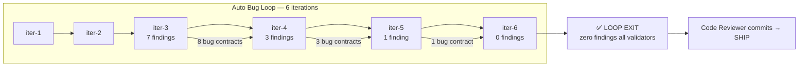

# Validation Synthesis — mcp-live-fix (Final)

> Auto Bug Loop converged at **Iteration 6** — all six validators report **zero findings of any kind**.
> Parent: `docs/contracts/2026-08-01-mcp-live-fix` · Revised 2026-08-02

## Loop Convergence Summary

| Validator | iter-1 | iter-2 | iter-3 | iter-4 | iter-5 | iter-6 |
|---|---|---|---|---|---|---|
| Code Reviewer | ✓ | ✓ | 3 LOW | 1 LOW | 1 LOW | ✅ **0** |
| Security Architect | ✓ | ✓ | ✓ | ✓ | ✓ | ✅ **0** |
| Performance Benchmarker | ✓ | ✓ | ✓ | ✓ | ✓ | ✅ **0** |
| User-Testing | ✓ | ✓ | 1 MED | ✓ | ✓ | ✅ **0** |
| SPEC Compliance | ✓ | ✓ | ✓ | ✓ | ✓ | ✅ **0** |
| Design Compliance | ✓ | ✓ | ✓ | ✓ | ✓ | ✅ **0** |

## Final Evidence (iter-6, read from report files)

- **Code Reviewer** — PASS (CLEAN-PASS), 0 items; iter-5 LOW (count_memories caveat) CLOSED; iter-4 LOW (REQ-FF docstring) CLOSED; full 471 Rust suite green.
- **Security Architect** — PASS-WITH-ZERO-FINDINGS; 0 critical/high/medium/low; comment-only diff; secrets scan clean; no production change.
- **Performance Benchmarker** — PASS, 0 findings; 8 benchmarks; comment-only delta; O(1) estimate intact; 471 Rust / 904 Python green.
- **User-Testing Validator** — PASS, 33/33 parent AC + 3/3 bug AC; zero carried forward; bridge-live E2E 23 passed; wireframe = code-only contract, no UI.
- **SPEC Compliance** — PASS-ZERO; parent 7/7 REQ + constraints; 41/41 bug contracts mapped; REQ-IV 3/3; no unmatched/partial/violations.
- **Design Compliance** — PASS-ZERO; 6/6 design dimensions; architecture/API/data-flow/wireframe match; window audit confirms only comment-doc files.

## Bug Contracts Resolved (41)

All 41 `bugs/` contracts under the parent delivered: filter coverage, count paths & docs (estimate invariant comments ×2), EFS precision/stderr, session-limit pin, log hygiene ×2, suite warning hygiene, fabricated-ID docstring/comment sweep (iter-5, iter-6), plus the original 39 contracts from iterations 1–4.

## Test Baselines (converged)

- Rust: `cd contexter-core && cargo test` → **471 passed / 0 failed**
- Python: `cd contexter-server && python3 -m pytest -q` → **904 passed / 0 failed / 0 warnings**

## Next Steps

1. Code Reviewer to create commits in logical groups (per scrutiny report groupings).
2. Generate implementation report (this contract).
3. SHIP: create PR → merge (branch retained) → launch checklist → session tracker finalized.